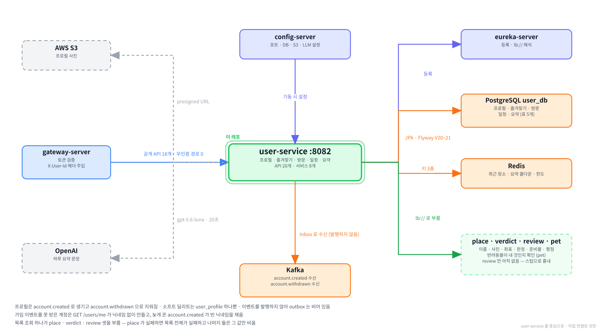

# user-service

**함께하개의 사용자 서비스입니다.** 프로필과 **사용자가 소유한 장소 목록**을 가집니다.
즐겨찾기 · 방문 기록 · 일정 · 하루 요약 · 최근 본 장소가 전부 여기 속합니다.
도메인 서비스 14개 중 **두 번째로 만들어진 서비스**이며, `auth` 다음으로 붙었습니다.

---

**먼저 전체 그림을 보고, 이 레포가 그 안 어디에 있는지 본 뒤 읽습니다.**

**① 전체 구조 — 층으로 본 것.** 위에서 아래로 요청이 내려가고, 어느 층에 무엇이 있는지.


**② 전체 구조 — 서비스끼리 무엇을 주고받는지.** 초록 실선이 `/internal` 호출, Kafka 표가 이벤트, 하늘색 점선이 VPC 경계.


**③ 이 레포를 중심으로.** 직접 연결된 것만 남긴 그림.



> ①② 는 `service-template/docs` 에 있는 것을 가리킵니다. 서비스가 늘어도 그쪽 한 곳만 고칩니다.

<br><br>

---

## 본문 시작

<br><br>

---

## 0. 이 서비스가 하는 일

```
브라우저  ──▶  게이트웨이  ──▶  user  :8082
                   │             │
                   │             ├──▶  PostgreSQL  user_db    프로필 · 즐겨찾기 · 방문 · 일정 · 요약
                   │             ├──▶  Redis                 최근 장소 · 요약 쿨다운 · 요약 한도
                   │             ├──▶  Kafka                 account.created · account.withdrawn 수신
                   │             ├──▶  S3                    프로필 사진
                   │             ├──▶  OpenAI                하루 요약 문장 생성
                   │             │
                   │             ├──▶  place    lb://place-service     장소 이름 · 사진 · 좌표
                   │             ├──▶  verdict  lb://verdict-service   동반 가능 판정 · 준비물
                   │             └──▶  review   lb://review-service    평점 · 후기 본문
                   │
                   └──▶  쿠키의 JWT 를 검증하고 X-User-Id · X-User-Role 을 붙여 넘김
                         user 는 토큰을 보지 않고 헤더만 믿음
```

> **user 는 이벤트를 발행하지 않습니다.** 받기만 합니다. 그래서 `outbox` 표는 있지만
> 언제나 비어 있고, 관리자 재발행 API 도 없습니다.

---

**숫자로 보면 이렇습니다.**

| | 개수 | 어디에 |
|---|---|---|
| API | **20개** | 공개 18개 + `/internal` 2개 |
| 테이블 | 5개 + 공통 대역 2개 | `user_profile` · `favorite` · `visit_log` · `itinerary_stop` · `daily_summary` |
| Redis 키 종류 | 3종 | 최근 장소 · 요약 쿨다운 · 요약 하루 한도 |
| 발행하는 이벤트 | **0개** | 발행자가 아닙니다 |
| 받는 이벤트 | 2개 | `account.created` · `account.withdrawn` |
| 부르는 우리 서비스 | 3개 | place · verdict · review |
| 부르는 바깥 시스템 | 2개 | AWS S3 · OpenAI |
| 서비스 클래스 | 7개 | [6-3](#6-3-서비스-클래스-7개--누가-무엇을-하나) |
| 에러 코드 | 7개 | [4-11](#4-11-에러-코드) |
| 자바 파일 | 97개 | 테스트 7개 별도 |
| 테스트 | 93개 | 서비스 6개 + `contextLoads` |

---

**하는 일을 사용자 입장에서 보면 이렇습니다.**

```
마이페이지     닉네임 · 프로필 사진 · 통계 셋(방문 · 후기 · 즐겨찾기)
즐겨찾기       하트를 눌러 담아 둔 장소 목록
방문 기록       지난 일정 카드의 [다녀왔어요] 로 쌓이는 기록.  그때의 판정이 함께 박힘
일정           날짜 단위로 담아 두는 방문 예정 목록.  달력에 점이 찍힘
하루 요약       [AI 요약하기] 를 누르면 그날 기록을 한 문장으로 만들어 줌
최근 본 장소     장소 상세를 열 때마다 자동으로 쌓이는 20곳
```

> **이 여섯 중 다섯이 "장소" 를 다룹니다.** 그래서 이 서비스의 절반은
> *장소 식별자만 가지고 있다가 다른 서비스에서 살을 붙여 카드를 만드는 일*입니다.
> 그 이야기가 [3장](#3-카드를-어떻게-조립하는가) 입니다.

---

**프로필은 이 서비스가 만들지 않습니다.**

```
가입     사용자 ──▶ auth ──▶ account.created ──▶ user 가 프로필을 만듦
탈퇴     사용자 ──▶ auth ──▶ account.withdrawn ──▶ user 가 자기 것을 지움
```

> `POST /users` 같은 API 가 없습니다. 프로필의 시작과 끝이 전부 이벤트입니다.
> 그 이야기가 [2장](#2-프로필의-생애) 입니다.

<br><br>

---

### 이 문서를 읽는 순서

| 지금 하려는 일 | 볼 곳 |
|---|---|
| 일단 띄워서 되는지 보고 싶다 | [1장](#1-로컬에서-띄우기) |
| 프로필이 어디서 생기고 어떻게 지워지는지 | [2장](#2-프로필의-생애) |
| 목록 응답이 왜 여러 서비스를 부르는지 | [3장](#3-카드를-어떻게-조립하는가) |
| API 를 부르려는데 요청·응답 형태를 모르겠다 | [4장](#4-api-20개) |
| 테이블·Redis 키·이벤트가 뭐가 있는지 | [5장](#5-데이터) |
| 코드를 고치려는데 어느 파일인지 모르겠다 | [6장](#6-코드-구조) |
| 설정값이 어디서 오는지 | [7장](#7-설정값) |
| 이벤트가 안 왔거나 탈퇴가 안 돌았다 | [8장](#8-운영) |
| "왜 이렇게 했지" 가 궁금하다 | [9장](#9-왜-이렇게-만들었나) |
| 뭔가 안 된다 | [10장](#10-막히기-쉬운-자리) |
| 모르는 말이 나온다 | [12장](#12-용어) |

<br><br>

---

### 먼저 알아 두면 좋은 것 5가지

**① 이 서비스는 혼자 화면을 못 그립니다.**

```
DB 에 있는 것      account_id · place_id · 날짜 · 메모        식별자와 값뿐
화면에 필요한 것    장소 이름 · 사진 · 판정 배지 · 평점         전부 남의 것
```

즐겨찾기 목록 하나를 내려주려고 **place · verdict · review 셋을 부릅니다.**
이것이 이 서비스를 읽을 때 가장 먼저 알아야 하는 사실입니다.

---

**② 게이트웨이가 이미 인증을 끝내 놓습니다.**

```
브라우저  ──쿠키의 JWT──▶  게이트웨이  ──X-User-Id: {uuid}──▶  user
                              검증               X-User-Role: USER
```

user 에는 로그인 코드가 없습니다. `@CurrentUser` 로 계정 식별자를 꺼내 쓸 뿐이고,
**그 값이 진짜인지는 묻지 않습니다.** 게이트웨이를 거치지 않으면 헤더가 없어 401 입니다.

---

**③ 이벤트는 카프카로 옵니다.**

`auth` 가 계정을 만들거나 지우면 메시지를 하나 보냅니다. user 는 그것을 받아
프로필을 만들거나 지웁니다. **같은 메시지가 두 번 올 수 있어서** 처리한 것을
`processed_event` 표에 적어 두고 두 번째는 건너뜁니다.

---

**④ 소프트 딜리트는 표 하나에만 있습니다.**

| | 지우는 방식 | 왜 |
|---|---|---|
| `user_profile` | **소프트** — `deleted_at` 을 찍고 남김 | 신원을 끊되 추적 근거는 남김 |
| 나머지 넷 | **하드** — 행을 지움 | `place_id` 와 날짜뿐이라 남겨서 얻을 것이 없음 |

---

**⑤ 설정은 이 레포에 거의 없습니다.**

`src/main/resources/application.yml` 에 **세 줄만** 있고 나머지는 전부
`paw-trail/config` 저장소에서 내려옵니다. 포트도 DB 주소도 거기 있습니다.
자세한 것은 [7장](#7-설정값) 입니다.

<br><br>

---

## 1. 로컬에서 띄우기

<br><br>

---

### 1-1. 무엇이 떠 있어야 하나

```
반드시                     없으면 어떻게 되나
  postgres                기동 실패.  Flyway 가 붙을 곳이 없음
  redis                   기동은 되고 최근 장소·요약에서 실패
  kafka                   기동은 되고 이벤트를 못 받음 (프로필이 안 생김)
  config-server           optional: 이라 기동은 되나 포트·DB 설정이 안 내려와 사실상 못 씀
  eureka-server           lb:// 를 못 풀어 place·verdict·review 호출이 전부 실패
  gateway-server          8080 으로 못 부름.  8082 직결은 됨

있으면 좋은 것
  auth-service            가입해서 프로필을 만들려면 필요함
  스텁 3개                 place · verdict · review 를 흉내 냄.  1-4 참고
```

---

**컨테이너부터 띄웁니다.**

```powershell
cd C:\Tour_Prj\infra
docker compose up -d
```

```bash
cd ~/Tour_Prj/infra
docker compose up -d
```

> **프로파일은 `.env` 의 `COMPOSE_PROFILES` 가 정합니다.** 명령에 `--profile` 을 붙이면
> `.env` 값이 **덮이는 것이 아니라 대체**되므로 평소에는 붙이지 않습니다.

| 프로파일 | 무엇 |
|---|---|
| `infra` | kafka · redis |
| `db` | postgres |
| `platform` | config-server · eureka-server · gateway-server |
| `tools` | kafka-ui (`:9000`) |
| `observability` | prometheus · loki · zipkin · grafana |
| `app` | 컨테이너로 도는 도메인 서비스 (지금은 auth 뿐) |

> **`user-service` 는 아직 `app` 프로파일에 없습니다.** 이미지를 굽고 나서 넣습니다.
> 그때까지는 IntelliJ 로 띄웁니다.

<br><br>

---

### 1-2. 환경변수 5개

**IntelliJ 실행 구성의 `Environment variables` 칸에 넣습니다.** `.env` 가 아닙니다 —
그것은 Docker Compose 가 읽는 파일이고 IntelliJ 는 보지 않습니다.

| 변수 | 값 | 없으면 |
|---|---|---|
| `DB_HOST` | `localhost` | `UnknownHostException: ${DB_HOST}` 로 **기동 실패** |
| `SERVICE_DB_PASSWORD` | `infra/.env` 에 있는 값 | 데이터베이스 인증 실패로 **기동 실패** |
| `AWS_ACCESS_KEY_ID` | IAM 사용자 `pawtrail-user-service` 의 키 | 사진 업로드·삭제에서 실패 |
| `AWS_SECRET_ACCESS_KEY` | 같은 사용자의 시크릿 | 위와 같음 |
| `OPENAI_API_KEY` | OpenAI 키 | 하루 요약이 502 |

> **앞의 둘에 기본값이 일부러 없습니다.** 있으면 *AWS 로 옮길 때 환경변수를 안 넣은 사람이
> 조용히 로컬 DB 에 붙는* 일이 생깁니다. 누락이 **기동 실패로 바로 드러나게** 두었습니다.
> 컨테이너로 띄울 때는 compose 가 `DB_HOST=postgres` 로 넣어 줍니다.

---

**칸이 안 보이면 `Modify options` → `Environment variables` 를 켭니다.**
값이 길어 넣기 불편하면 칸 오른쪽 끝의 문서 아이콘을 눌러 표로 입력합니다.

<br><br>

---

### 1-3. 띄우고 확인하기

```
① 빌드           ./gradlew clean build
② 실행           IntelliJ 에서 UserApplication
③ 기동 확인      curl http://localhost:8082/actuator/health          →  UP
④ 유레카 등록     http://localhost:8761  에  USER-SERVICE  가 보이는지
⑤ 게이트웨이 경유  8080 으로 아무 API 나 불러 401 이 아닌 응답이 오는지
```

> ⛔ **`/actuator/health` 가 `UP` 인 것만으로 끝내지 마십시오.**
> 유레카 등록이 실패해도 그 컴포넌트가 `UNKNOWN` 이면 전체 판정에서 무시되어
> **`UP` 이 그대로 나옵니다.** 실제로 그것 때문에 서비스가 조용히 등록되지 않은 채로
> 한동안 지나간 적이 있습니다. ④ 를 따로 봅니다.

---

**IntelliJ 로 띄운 직후에는 게이트웨이가 30초쯤 503 을 냅니다.** 레지스트리를 갱신할
때까지 기다렸다가 다시 부르면 됩니다.

<br><br>

---

### 1-4. 스텁 서버 3개

**place · verdict · review 는 아직 만들어지지 않았습니다.** 그런데 이 서비스의 목록
API 는 그 셋을 부릅니다. 그래서 흉내 내는 작은 서버 셋을 따로 띄웁니다.

| 포트 | 흉내 내는 것 | 언제 필요한가 |
|---|---|---|
| `19001` | place | **목록 API 전부.** 장소 이름이 없으면 카드가 성립하지 않아 목록 전체가 실패함 |
| `19002` | verdict | `POST /visits` 에서 `petId` 를 보낼 때 · 판정 배지를 보고 싶을 때 |
| `19003` | review | `GET /users/me` 의 후기 수 · 하루 요약의 재료 |

```
스텁 서버는 어느 저장소에도 커밋되어 있지 않습니다.
각자 로컬에만 있으며 새로 받는 사람은 만들어야 합니다.
```

---

**실패를 일부러 만들 수 있습니다.**

| | 무엇 |
|---|---|
| `POST /stub/mode?fail=true` | 그 스텁이 전부 실패하게 함 |
| `POST /stub/mode?drop=N` | 요청한 것 중 N 개를 빼고 돌려줌 |
| `POST /stub/mode?delayMs=N` | 응답을 늦춤. 타임아웃 검증용 |
| `POST /stub/mode/reset` | 되돌림. **`/stub/reset` 이 아닙니다** |
| `GET /stub/mode` | 지금 상태 |

> **`petId` 를 안 보내면 `verdict` 스텁이 없어도 됩니다.** 판정 계산이
> `petId == null` 이면 호출을 아예 건너뛰고 `UNKNOWN` 을 돌려주기 때문입니다.
> 대표 반려동물 지정이 아직 막혀 있어 실제로도 언제나 `null` 입니다.

<br><br>

---

### 1-5. 검증에 쓰는 계정

| 계정 | 무엇 |
|---|---|
| `pawtrail.noreply+u1@gmail.com` / `test1234` | 닉네임 `다정이네`. **user API 검증은 이 계정으로** |
| 그 밖의 auth 계정들 | `#3` 이전에 가입해 **프로필 행이 아예 없습니다.** `GET /users/me` 가 404 |

> ⚠ **404 를 인증 문제로 오해하기 쉽습니다.** 프로필이 없는 것뿐입니다.

---

**새 계정을 만들려면 이메일 인증을 먼저 통과해야 합니다.** 메일함을 여는 대신
Redis 에 인증 표시를 직접 넣으면 됩니다.

```powershell
docker compose exec redis redis-cli SET "emailverified:{이메일}" 1 EX 1800
```

```bash
docker compose exec redis redis-cli SET "emailverified:{이메일}" 1 EX 1800
```

그다음 `POST /api/v1/auth/signup` 을 부르면 **자동 로그인이라 쿠키가 바로 실려 옵니다.**

<br><br>

---

### 1-6. 게이트웨이를 거칠까 직결할까

| | 언제 | 무엇이 다른가 |
|---|---|---|
| `:8080` 게이트웨이 | 평소 | 쿠키로 인증. 실제 사용자와 같은 경로 |
| `:8082` 직결 | 변수를 줄이고 싶을 때 | `X-User-Id` · `X-User-Role` 헤더를 손으로 넣음 |

```powershell
curl.exe -s "http://localhost:8082/api/v1/users/me" `
  -H "X-User-Id: 01a0726a-64e9-7712-9ecb-4996e2dcd75f" -H "X-User-Role: USER"
```

> **직결이 편한 경우가 실제로 있습니다.** 로그인·쿠키·토큰 만료가 통째로 빠지고,
> 게이트웨이가 라우팅 실패를 401 로 바꿔 내보내는 함정도 안 밟습니다.
> `/internal` 두 개는 **게이트웨이가 라우팅하지 않아 직결로만 부를 수 있습니다.**

<br><br>

---

## 2. 프로필의 생애

**이 장을 먼저 읽으면 3장과 4장이 훨씬 쉽습니다.**
이 서비스에는 프로필을 만드는 API 도 지우는 API 도 없습니다.

<br><br>

---

### 2-1. 이벤트로 생기고 이벤트로 지워진다

```
회원가입
   사용자 ──▶ auth ──▶ account.created ──▶ user   user_profile 행 생성
                       {accountId, email, nickname}       nickname 을 payload 에서 받음

탈퇴
   사용자 ──▶ auth ──▶ account.withdrawn ──▶ user  프로필 익명화 + 나머지 삭제
                       {accountId}                        식별자만 옴
```

| | `account.created` | `account.withdrawn` |
|---|---|---|
| payload | `accountId` · `email` · `nickname` | `accountId` **하나뿐** |
| 하는 일 | 행을 만듦 | 프로필을 익명화하고 나머지를 지움 |
| 값을 나르나 | **예.** 유일하게 값을 나르는 이벤트 | 아니오. 열쇠로만 씀 |

> **`account.created` 만 값을 나릅니다.** `nickname` 의 소유자가 `user_profile` 인데
> auth 에는 그 컬럼이 없어 **받는 쪽이 다시 읽을 곳이 없기 때문**입니다.
> 반대로 탈퇴는 담으면 *지우려는 개인정보가 이벤트로 흘러* 소비자들의 로그에 남습니다.

---

**`email` 은 받아서 버립니다.**

```
user_profile 에 email 컬럼이 없음
   │
   └──▶ 두면 auth 가 소유한 값을 user 가 복제해 갖게 됨
        탈퇴하면 auth 는 withdrawn+{id}@pawtrail.invalid 로 치환하는데
        user 는 옛 값을 그대로 들고 있어 *끊긴 줄 알았던 개인정보가 여기 남음*
```

> payload 에서 빼지는 않습니다. 나중에 `notification` 이 같은 이벤트를 구독할 수 있고
> **받아서 안 쓰는 비용이 0** 이기 때문입니다.

<br><br>

---

### 2-2. 가입 직후에 404 가 날 수 있습니다

```
회원가입 성공 (쿠키 2개를 심어 자동 로그인)
   │
   ├──▶ auth 가 outbox 에 account.created 를 적음
   │        │
   │        └──▶ 커밋 후 발행 ──▶ Kafka ──▶ user 가 프로필을 만듦
   │
   └──▶ 프론트가 바로 GET /users/me 를 부름
            │
            └──▶ ⛔아직 프로필이 없으면 404
```

> **실제 창은 밀리초 단위입니다.** 프론트가 짧게 재시도하면 지나갑니다.
> 동기 호출(`POST /internal/users`)을 쓰지 않은 것은 **트랜잭션이 갈리기 때문**입니다 —
> auth 는 성공했는데 user 가 실패하면 프로필 없는 계정이 남고 보상을 따로 짜야 합니다.

<br><br>

---

### 2-3. 탈퇴하면 무엇이 지워지나

```
account.withdrawn  {accountId}
        │
        ├──▶ user_profile      소프트 딜리트
        │                       nickname          → "탈퇴한 사용자"
        │                       profile_image_url → 비움
        │                       account_id · default_pet_id 는 그대로
        │
        ├──▶ favorite           하드 딜리트
        ├──▶ visit_log          하드 딜리트
        ├──▶ itinerary_stop     하드 딜리트
        ├──▶ daily_summary      하드 딜리트
        │
        ├──▶ recent:places:{accountId}        Redis.  커밋 뒤에 지움
        └──▶ S3 users/{accountId}/profile     커밋 뒤에 지움
```

---

**소프트 딜리트가 `user_profile` 하나뿐인 이유입니다.**

| | 담긴 것 | 남기면 |
|---|---|---|
| `user_profile` | **닉네임 · 프로필 사진** | 신원이라 반드시 끊어야 함. 대신 행은 남겨 추적 근거로 |
| `favorite` 외 셋 | `place_id` · 날짜 · 메모 | 개인 식별 정보가 아니라 남겨서 얻을 것이 없음 |

> **닉네임을 비우지 않고 치환합니다.** 이 컬럼의 `null` 은 이미 *"아직 설정 안 함"* 이라는
> 뜻을 가지고 있어서, 비우면 **소셜 가입 직후와 탈퇴 후가 같은 모양**이 됩니다.

---

**하드 딜리트인 것에는 다른 이유도 있습니다.**

```
favorite 의 UNIQUE(account_id, place_id) 는 deleted_at 을 보지 않음
   하트 켜기 → 끄기(소프트) → 다시 켜기  →  ⛔UNIQUE 충돌
   즐겨찾기는 껐다 켰다 하는 기능이라 탈퇴와 달리 흔하게 일어남

visit_log 의 UNIQUE(itinerary_stop_id) 도 같음
   [다녀왔어요] → 기록 삭제 → 다시 누름  →  ⛔충돌
```

<br><br>

---

### 2-4. 프로필이 놓일 수 있는 상태가 셋입니다

`account.withdrawn` 이 도착했을 때 프로필은 셋 중 하나입니다.

| 상태 | 언제 | 무엇을 하나 |
|---|---|---|
| **정상** | 평범한 탈퇴 | 익명화하고 삭제 시각을 찍음 |
| **이미 탈퇴 표시** | 두 번째로 도착했거나, 아래 표시 행이 이미 있음 | **프로필을 건드리지 않음** |
| **행이 아예 없음** | `account.created` 보다 탈퇴가 먼저 도착 | **삭제 표시 행을 만듦** |

```
findByIdIncludingDeleted(accountId)
        │
        ├── 비어 있음          ──▶  ③ 표시 행 생성
        ├── isDeleted() true  ──▶  ② 로그만 남기고 넘어감
        └── 그 밖              ──▶  ① 익명화 + 삭제 시각
```

> **`findById` 로는 ②와 ③이 구분되지 않습니다.** 엔티티에 걸린
> `@SQLRestriction("deleted_at IS NULL")` 이 삭제 표시 행을 가려 **둘 다 비어 있는
> `Optional`** 로 보이기 때문입니다. 그래서 그 제한을 우회하는 네이티브 조회를 씁니다.

<br><br>

---

### 2-5. 순서가 뒤집히면 왜 위험한가

```
auth 가 계정을 만듦
   │
   ├──▶ account.created 가 outbox 에 멈춤 (Kafka 장애 등)
   │
사용자가 탈퇴
   │
   └──▶ account.withdrawn 이 먼저 도착 ──▶ user 에 지울 프로필이 없음
                                            │
                                            └──▶ 아무것도 안 하면?
                                                    │
   나중에 account.created 가 재발행 ──────────────────┘
                                                    │
                                                    └──▶ ⛔탈퇴한 계정의 프로필이
                                                          뒤늦게 생김 (고아 행)
```

---

**그래서 계정 식별자만 채우고 삭제 시각을 찍은 행을 미리 만들어 둡니다.**

```
탈퇴 표시 행
  account_id          이벤트가 준 값
  nickname            비어 있음    ← 치환하지 않음.  가진 적 없는 신원은 지울 것이 없음
  profile_image_url   비어 있음
  deleted_at          찍혀 있음
  deleted_by          SYSTEM
```

`account.created` 를 처리할 때 **`existsIncludingDeleted` 가 이 행을 보고 멈춥니다.**

```java
if (userProfileRepository.existsIncludingDeleted(accountId)) {
    log.info("이미 처리된 계정입니다. 프로필을 만들지 않습니다: accountId={}", accountId);
    return;
}
```

> **이 조회도 네이티브 쿼리입니다.** 같은 이유로 `@SQLRestriction` 을 우회해야 합니다.
> `existsById` 로는 표시 행이 보이지 않아 방어가 통째로 무력해집니다.

<br><br>

---

### 2-6. 쓰기 경로는 프로필을 확인하지 않습니다

**프로필이 없는데 다른 표에는 행이 있는 상태**가 실제로 만들어질 수 있습니다.

```
읽기   GET /users/me · GET /favorites …        프로필을 먼저 찾고 없으면 404
쓰기   POST /favorites · POST /recent-places   ⛔프로필을 보지 않음.  그냥 저장함
```

```
가입 (자동 로그인이라 쿠키가 이미 있음)
   │
   ├──▶ account.created 가 발행에 실패해 멈춤
   │
   └──▶ 사용자는 로그인 상태
            GET /users/me      404
            POST /favorites    ✅성공.  행이 생김
```

> **막지 않는 것이 의도입니다.** 계정 자체는 auth 에 있고 게이트웨이가 토큰을 검증했으므로
> **그 데이터는 정당합니다.** 쓰기를 404 로 막으면 *발행이 잠깐 늦은 것만으로 담기가 막힙니다.*

---

**그래서 탈퇴 정리는 프로필 상태와 무관하게 항상 실행합니다.**

```
프로필 처리   세 갈래로 갈림         ← 2-4
정리         갈래와 무관하게 항상    ← 표 4개 · Redis · S3
```

> 갈래에 매달면 **표시 행만 만들고 끝낸 계정의 즐겨찾기가 그대로 남고,**
> `auth` 가 같은 이벤트를 두 번 내보내지 않으므로 **지울 기회가 다시 오지 않습니다.**

<br><br>

---

### 2-7. Redis 와 S3 는 커밋 뒤에 지웁니다

```
트랜잭션 안                          트랜잭션 밖 (커밋 이후)
  프로필 익명화                        recent:places:{accountId}  삭제
  표 4개 벌크 삭제                     S3 users/{accountId}/profile  삭제
  processed_event INSERT              실패해도 로그만 남김
```

| | 왜 |
|---|---|
| 안에 두면 | 뒤에서 롤백이 났을 때 **데이터베이스만 되돌아가고 지운 것은 그대로** |
| 되돌릴 수 없음 | 사진을 먼저 지우고 정리가 실패하면 *프로필은 남았는데 사진만 없는* 상태 |
| 실패하면 | 로그만. 이벤트 처리는 성공으로 끝나며 **그 이벤트는 다시 오지 않음** |

> **남아도 닿을 방법이 없습니다.** 그 계정으로 로그인할 수 없고,
> 사진 주소를 만들어 주는 조회가 탈퇴한 계정을 돌려주지 않습니다.
> S3 는 버킷의 수명 주기 규칙으로 나중에 치울 수 있습니다.

---

**둘을 따로 걸어 둡니다.**

```java
afterCommitExecutor.run(() -> recentPlaceStore.deleteAll(accountId),
        "탈퇴 뒤 최근 장소 삭제: accountId=" + accountId);

afterCommitExecutor.run(() -> storageProvider.delete(storageProvider.profileImageKey(accountId)),
        "탈퇴 뒤 프로필 사진 삭제: accountId=" + accountId);
```

> **한 번에 넘기면 앞엣것이 실패했을 때 뒤엣것이 아예 실행되지 않습니다.**
> Redis 키가 남는 것과 사진이 남는 것 사이에는 아무 관계도 없고,
> 실패했을 때 무엇이 남았는지가 로그에서 특정되려면 나눠 두어야 합니다.

<br><br>

---
## 3. 카드를 어떻게 조립하는가

**이 서비스가 가진 것은 식별자뿐입니다.** 화면에 필요한 것은 대부분 남의 것입니다.

<br><br>

---

### 3-1. 화면 넷이 같은 카드를 씁니다

```
즐겨찾기        방문 기록        일정          최근 본 장소
   │              │             │               │
   └──────────────┴─────────────┴───────────────┘
                       │
              같은 모양의 장소 카드
              이름 · 사진 · 분류 · 판정 배지 · 준비물 · 평점
```

| | 목록이 어디서 나오나 | 하트 | `favorite` 을 따로 부르나 |
|---|---|---|---|
| 즐겨찾기 | `favorite` 표 | 해제만 | **안 부름** — 거기 있는 것이 곧 담긴 것 |
| 방문 기록 | `visit_log` 표 | 추가·해제 | 부름 |
| 일정 | `itinerary_stop` 표 | 없음 | 안 부름 |
| 최근 본 장소 | **Redis Sorted Set** | 추가·해제 | 부름 |

> **목록 출처가 무엇이냐가 나머지를 결정합니다.** 즐겨찾기는 목록 자체가 그 표에서
> 나오므로 *"내가 담았나"* 를 물을 이유가 없고, 최근 장소는 Redis 에서 나와
> 즐겨찾기와 무관한 장소들이라 따로 물어야 합니다.

<br><br>

---

### 3-2. 한 번의 목록 조회가 네 곳을 부릅니다

```
GET /api/v1/favorites
     │
     ├──▶ favorite 표에서 place_id 목록을 꺼냄        [aaa, bbb, ccc]
     │
     ├──▶ place    GET /internal/places?ids=         이름 · 사진 · 분류 · 좌표
     ├──▶ verdict  POST /internal/verdicts/batch     판정 배지 · 준비물
     ├──▶ review   GET /internal/reviews/stats       평점 평균
     │
     └──▶ 넷을 place_id 로 맞춰 카드로 조립
```

| 부르는 곳 | 무엇을 받나 | 어떻게 부르나 |
|---|---|---|
| place | `placeId` · `name` · `placeType` · `imageUrl` · `lat` · `lon` · `supplyPoint` | 식별자 목록을 한 번에 |
| verdict | 판정값 · `requiredItems` | 식별자 목록 + 대표 펫 하나 |
| review | `ratingAvg` | 식별자 목록을 한 번에 |
| favorite (자기 표) | 담아 둔 `place_id` 집합 | 화면에 따라 부르거나 안 부름 |

> **전부 목록으로 한 번에 부릅니다.** 장소마다 부르면 20곳짜리 목록에 호출이 20번입니다.

<br><br>

---

### 3-3. ⛔실패를 자리마다 다르게 다룹니다

**이 서비스에서 가장 헷갈리는 자리입니다.** 세 곳의 실패가 서로 다른 결과를 냅니다.

| 실패한 곳 | 목록 API 는 | 왜 |
|---|---|---|
| **place** | ⛔**목록 전체를 실패시킴** | 이름이 없으면 카드가 성립하지 않음. 사용자가 무엇을 담아뒀는지 알 수 없게 됨 |
| **verdict** | 배지와 준비물만 비우고 목록은 그대로 | *"내가 담아둔 곳 목록"* 이라는 화면의 목적은 그것 없이도 이뤄짐 |
| **review** | 평점만 비우고 목록은 그대로 | 통계 한 칸 때문에 화면이 안 뜨면 안 됨 |

```
place 실패      →  500                  카드를 그릴 수 없음
verdict 실패    →  200 · verdict null   배지 자리를 비움
review 실패     →  200 · ratingAvg null 별점 자리를 비움
```

---

**⛔`POST /visits` 만 반대입니다.**

```
GET  /visits    verdict 실패  →  200.  준비물만 비움
POST /visits    verdict 실패  →  ⛔502 VERDICT_UNAVAILABLE.  기록을 아예 안 만듦
```

| | 무엇이 다른가 |
|---|---|
| `GET` 의 준비물 | **지금 값.** 다음에 열면 다시 불러 채워짐 |
| `POST` 가 저장하는 판정 | **그때의 스냅샷.** 한 번 박히면 고치는 API 가 없음 |

> **틀린 값이 영구히 남기 때문입니다.** 조건이 바뀌어도 안 바뀌는 것이
> `verdict_at_visit` 의 존재 이유인데, 서버 장애로 잘못된 값이 들어가면
> 나중에 그것이 장애였는지 실제 판정이었는지 알 방법이 없습니다.

<br><br>

---

### 3-4. `UNKNOWN` 은 뜻이 둘입니다

```
GET /users/me 의 defaultPetId 가 null    →  verdict 를 아예 안 부름.  UNKNOWN
defaultPetId 가 있는데 UNKNOWN            →  verdict 가 실제로 계산한 결과
```

| 프론트가 보는 상태 | 무엇을 띄우나 |
|---|---|
| `verdict` 값 + `defaultPetId` 있음 | 판정 배지 |
| `UNKNOWN` + `defaultPetId` **없음** | *"대표 반려동물을 설정해 주세요"* |
| `UNKNOWN` + `defaultPetId` 있음 | *"조건 정보 없음"* |
| `verdict` 가 `null` | 배지를 비우거나 *"판정을 불러오지 못했어요"* |

> ⛔ **`UNKNOWN` 만 보고 *"대표 펫이 없습니다"* 로 쓰면 안 됩니다.**
> 조건이 안 적힌 장소를 담아둔 사람에게도 그 문구가 뜹니다.

---

**판정 기준은 언제나 대표 반려동물 한 마리입니다.**

```
요청에 petIds 를 받지 않음
   │
   └──▶ 서버가 user_profile.default_pet_id 를 씀
        없으면 verdict 를 호출하지 않고 UNKNOWN 으로 채움 (호출이 한 번 줄어듦)
```

<br><br>

---

### 3-5. 없는 장소는 카드에서 빠집니다

```
place 가 돌려준 목록에 그 place_id 가 없음
   │
   └──▶ 그 카드를 만들지 않고 건너뜀.  오류로 보지 않음
```

> **`size=8` 로 요청했는데 7장이 올 수 있습니다.** 네 화면이 전부 그렇습니다.

---

**그렇다고 우리 표에서 지우지는 않습니다.**

| | 왜 |
|---|---|
| 읽기가 쓰기를 하게 됨 | `GET` 인데 부수효과가 생김 |
| ⛔**구분할 수 없음** | *조회 실패*와 *장소 소멸*이 똑같이 "안 옴" 으로 보임 |

> place 가 일부만 돌려주는 경우가 실제로 있습니다. 그때 안 온 장소를 지우면
> **멀쩡한 이력이 사라집니다.**

---

**대신 유령 행이 남습니다.**

```
관리자가 잘못 묶인 소스를 분리하거나 재수집에서 두 장소가 합쳐지면
   저장해 둔 place_id 가 place_db 에서 없어짐
        │
        ├──▶ 카드에는 안 나옴 (조립에서 빠짐)
        └──▶ ⛔행은 남고, 사용자는 카드가 안 보여 지울 수도 없음
```

> 지우는 API 도 배치도 없습니다. `place.updated` 에 *"삭제"* 이벤트도 없습니다.
> [11장](#11-아직-안-한-것) 에 남겨 두었습니다.

<br><br>

---

### 3-6. 부를 때 `@Qualifier` 를 반드시 붙입니다

공통 모듈이 `RestClient.Builder` 빈을 **셋** 등록합니다.

| 빈 이름 | 무엇이 붙어 있나 | 언제 |
|---|---|---|
| `internalRestClientBuilder` | `@LoadBalanced` + 인증 헤더 인터셉터 + 타임아웃 | **우리 서비스를 부를 때** |
| `externalRestClientBuilder` | 타임아웃만 | 카카오맵·기상청 같은 바깥 |
| `defaultRestClientBuilder` | **아무것도 없음.** `@Primary` | 유레카 같은 라이브러리가 타입으로 찾아갈 때 |

```java
public PlaceProviderImpl(@Qualifier("internalRestClientBuilder") RestClient.Builder builder) {
    this.restClient = builder.baseUrl("lb://place-service").build();
}
```

> ⛔ **빠뜨리면 `@Primary` 인 맨 빌더가 조용히 주입됩니다.** 기동은 되고
> **호출하는 순간에 `lb://` 를 못 풀어 실패합니다.** 롬복 `@RequiredArgsConstructor`
> 로는 `@Qualifier` 를 못 붙이므로 **생성자를 손으로 씁니다.**

---

**S3 와 OpenAI 는 `defaultRestClientBuilder` 를 씁니다.**

```
S3       AWS SDK 가 자기 클라이언트를 씀 (서명 계산 때문)
OpenAI   defaultRestClientBuilder + 전용 타임아웃 20초
         ⛔internal 빌더를 쓰면 안 됨 — OpenAI 에 우리 X-User-Id 를 보낼 이유가 없음
```

<br><br>

---

### 3-7. 타임아웃

| | 값 | 어디서 |
|---|---|---|
| 연결 | 2초 | config 1계층 `app.rest-client.connect-timeout` |
| 읽기 | 5초 | config 1계층 `app.rest-client.read-timeout` |
| **LLM 읽기** | **20초** | config 2계층 `app.llm.timeout-seconds` |

> **LLM 만 따로 둔 이유입니다.** 전역 값을 20초로 늘리면 *place 가 5초 안에 안 와도
> 20초를 기다리게* 됩니다. 그래서 그 호출에만 쓰는 클라이언트를 따로 만듭니다.

<br><br>

---

## 4. API 20개

전부 게이트웨이(`:8080`)를 거쳐 부릅니다. 응답은 공통 형식입니다.

```json
{ "code": "SUCCESS", "message": "...", "data": { }, "traceId": "..." }
```

> **`/internal` 둘은 게이트웨이가 라우팅하지 않습니다.** 다른 서비스가
> `lb://user-service` 로 직접 부르는 경로이며, 브라우저에서는 닿을 수 없습니다.

<br><br>

---

### 4-1. 목록

| # | 메서드 | 경로 | 인증 | 하는 일 |
|---|---|---|---|---|
| 1 | GET | `/api/v1/users/me` | 필요 | 프로필 + 통계 셋 |
| 2 | PATCH | `/api/v1/users/me` | 필요 | 닉네임 · 사진 수정 |
| 3 | POST | `/api/v1/users/me/upload-url` | 필요 | 사진 업로드 주소 발급 |
| 4 | PATCH | `/api/v1/users/me/default-pet` | 필요 | 대표 반려동물. **지금은 해제만** |
| 5 | GET | `/api/v1/favorites` | 필요 | 즐겨찾기 목록 |
| 6 | POST | `/api/v1/favorites` | 필요 | 담기. **멱등** |
| 7 | DELETE | `/api/v1/favorites/{placeId}` | 필요 | 해제. **멱등** |
| 8 | GET | `/api/v1/visits` | 필요 | 방문 기록 목록 |
| 9 | POST | `/api/v1/visits` | 필요 | [다녀왔어요] |
| 10 | DELETE | `/api/v1/visits/{visitId}` | 필요 | 기록 삭제 |
| 11 | GET | `/api/v1/itineraries?date=` | 필요 | 그날 일정 |
| 12 | POST | `/api/v1/itineraries` | 필요 | 일정에 담기 |
| 13 | PATCH | `/api/v1/itineraries/{stopId}` | 필요 | 시각 · 펫 · 메모 수정 |
| 14 | DELETE | `/api/v1/itineraries/{stopId}` | 필요 | 일정 삭제. **방문 기록도 함께** |
| 15 | GET | `/api/v1/itineraries/dates?from=&to=` | 필요 | 일정이 있는 날짜만 |
| 16 | POST | `/api/v1/users/me/recent-places` | 필요 | 최근 본 장소 기록 |
| 17 | GET | `/api/v1/users/me/recent-places?size=` | 필요 | 최근 본 장소 목록 |
| 18 | POST | `/api/v1/users/me/daily-summary` | 필요 | 하루 AI 요약 생성 |
| 19 | GET | `/internal/users?ids=` | — | review · report 가 작성자 이름을 채울 때 |
| 20 | GET | `/internal/favorites?placeId=` | — | notification 이 조건 변경 대상자를 찾을 때 |

> **무인증 경로가 0개입니다.** 그래서 이 서비스에는 `SecurityConfig` 가 없고
> 공통 모듈의 기본 체인이 그대로 씁니다.
> 부수적으로 `/swagger-ui/**` 도 401 입니다.

<br><br>

---

### 4-2. `GET /users/me` — 프로필

```
GET /api/v1/users/me
     │
     ├──▶ user_profile 조회        없으면 404
     ├──▶ visit_log COUNT          visitCount
     ├──▶ favorite  COUNT          favoriteCount
     ├──▶ review 호출              reviewCount   ⛔실패하면 null
     └──▶ 사진 키에 서명을 붙여 주소로
```

**응답**

| 필드 | 타입 | 설명 |
|---|---|---|
| `accountId` | uuid | |
| `nickname` | string · **null 가능** | 소셜 가입은 아직 없음 |
| `profileImageUrl` | string · null 가능 | **서명이 붙은 주소.** 1시간 뒤 만료 |
| `defaultPetId` | uuid · null 가능 | |
| `stats.visitCount` | number | 우리 표를 셈 |
| `stats.favoriteCount` | number | 우리 표를 셈 |
| `stats.reviewCount` | number · **null 가능** | review 호출 실패 시 `null` |

> **`stats` 는 컬럼이 아닙니다.** 조회할 때마다 셉니다. 비정규화 컬럼을 두면
> **후기가 삭제된 것을 모르게 됩니다.**

| 실패 | 코드 |
|---|---|
| 프로필 없음 | `404 RESOURCE_NOT_FOUND` |

<br><br>

---

### 4-3. `PATCH /users/me` — ⛔"안 보냄" 과 "명시적 null" 이 다릅니다

| 요청 | 결과 |
|---|---|
| `{}` | 둘 다 그대로 |
| `{"nickname":"다정이네"}` | 닉네임만 바뀜. **사진은 그대로** |
| `{"profileImageUrl":"https://..."}` | 사진만 바뀜. **닉네임은 그대로** |
| `{"profileImageUrl":null}` | 사진 지움 (기본 이미지가 뜸) |
| `{"nickname":null}` | ⛔`400` |

```
Jackson 은 JSON 에 그 키가 있을 때만 세터를 부름
   │
   └──▶ 세터에서 "왔다" 플래그를 세우면 세 상태가 갈림
        안 보냄 / 값이 옴 / 명시적 null
```

> **그래서 이 요청만 `record` 가 아닙니다.** `Optional` 로 받는 방법은 Jackson 이
> *"없음"* 과 *"명시적 null"* 을 **둘 다 `Optional.empty()`** 로 만들 수 있어 쓰지 않았습니다.

---

**닉네임은 지울 수 없고 사진은 지울 수 있습니다.**

| | `null` 을 허용하나 | 왜 |
|---|---|---|
| `nickname` | ⛔아니오 | 화면에 *"닉네임 지우기"* 가 없고, 비면 후기 목록과 관리자 화면의 이름이 빈칸이 됨 |
| `profileImageUrl` | 예 | `null` 이 *"사진 없음"* 이라 기본 이미지가 뜨고 화면이 성립함 |

| 실패 | 코드 |
|---|---|
| 닉네임이 명시적 `null` | `400 VALIDATION_FAILED` |
| 닉네임 길이가 2~20 밖 | `400 VALIDATION_FAILED` |
| 사진 주소가 발급한 것과 다름 | `400 VALIDATION_FAILED` |

<br><br>

---

### 4-4. `POST /users/me/upload-url` — 사진 업로드 3단계

**서버는 파일을 받지 않습니다.** 주소만 만들어 주고 브라우저가 S3 로 직접 올립니다.

```
① POST /users/me/upload-url  {contentType, contentLength}
        │
        ├──▶ 상한 검사       20MiB 를 넘으면 400.  S3 로 요청이 가지도 않음
        └──▶ 서명 생성       users/{accountId}/profile        만료 600초
        │
        ▼   {uploadUrl, fileUrl, expiresIn}
② PUT  {uploadUrl}          Content-Type 을 ①과 똑같이
        │
        └──▶ ⛔타입이나 크기가 다르면 S3 가 403.  둘 다 서명에 들어 있음
        │
        ▼
③ PATCH /users/me  {"profileImageUrl": "{fileUrl}"}
        │
        ├──▶ 서버가 만든 정답과 대조.  다르면 400
        └──▶ DB 에는 *주소가 아니라 키*를 저장
```

**요청**

| 필드 | 타입 | 필수 | 설명 |
|---|---|---|---|
| `contentType` | string | ● | `image/jpeg` 또는 `image/png` |
| `contentLength` | number | ● | **올릴 파일의 정확한 바이트 수** |

> **`fileName` 을 받지 않습니다.** 키가 계정당 하나로 고정이라 이름이 필요 없습니다.

**응답**

| 필드 | 설명 |
|---|---|
| `uploadUrl` | 서명이 붙은 PUT 용 주소 |
| `fileUrl` | ③에 담아 보낼 값. **서명이 없어 이 주소로는 안 열립니다** |
| `expiresIn` | `600` |

---

**⛔프론트가 반드시 지켜야 하는 것**

```
contentLength 는 올릴 파일의 정확한 크기      file.size
   리사이즈를 한다면 원본이 아니라 *줄인 결과*의 크기
PUT 의 Content-Type 을 요청한 값과 똑같이
   타입과 크기가 둘 다 서명에 들어 있어 하나라도 다르면 403
20MiB 를 넘으면 발급이 400
   "사진이 너무 큽니다" 로 안내할 것
```

> **서버가 리사이즈를 대신할 수 없습니다.** 파일이 서버를 거치지 않는 것이
> 이 방식을 쓴 이유입니다.

---

**키가 계정당 하나로 고정입니다.**

```
users/{accountId}/profile        확장자 없음
```

| | 왜 |
|---|---|
| 고정 | 새 사진이 덮어써져 **지우는 코드가 아예 없음.** 남의 파일을 지우는 구멍이 안 생김 |
| 확장자 없음 | 브라우저는 `Content-Type` 헤더를 보고 그림. `.jpg` 로 고정하면 PNG 가 `.jpg` 가 됨 |
| DB 에는 키만 | 조회 방식이 바뀌어도 데이터를 안 건드림. CloudFront 를 붙이면 조립만 바꿈 |

<br><br>

---

### 4-5. `PATCH /users/me/default-pet` — ⛔지금은 해제만 됩니다

| 요청 | 결과 |
|---|---|
| `{"petId": null}` | 대표 해제. 정상 |
| `{"petId": "..."}` | ⛔`400 VALIDATION_FAILED` |

```
default_pet_id 는 소유권 검증을 우회하는 경로임
   │
   └──▶ verdict 를 부를 때 petIds 를 생략하면 서버가 이 값을 씀
        남의 petId 를 저장해 두면 그 반려동물 기준으로 판정을 받아볼 수 있음
```

> **pet 서비스가 없어 *"이 펫이 정말 내 것인가"* 를 확인할 수단이 없습니다.**
> 못 하면 막는 것이 맞다고 보아 닫아 두었습니다. 코드에 `TODO(pet 착수 시)` 주석이 있습니다.

<br><br>

---

### 4-6. 즐겨찾기 3개

**`GET /api/v1/favorites`**

```
favorite 표 (created_at 최신순)  ──▶  place · verdict · review 를 불러 조립
```

| 필드 | 설명 |
|---|---|
| `placeId` · `name` · `placeType` · `imageUrl` | place 에서 |
| `verdict` · `requiredItems` | verdict 에서. **실패하면 `null`** |
| `ratingAvg` | review 에서. 실패하거나 후기가 없으면 `null` |
| `memo` · `createdAt` | 우리 표에서 |

> **페이징하지 않고 담기 상한도 없습니다.** 프론트가 응답 전체를 `placeType` 으로 세어
> 카테고리 칩을 만들고 0건이면 안 그리기 때문에, 페이지로 자르면 **칩 개수와 필터가
> 페이지마다 갈려 화면 규칙이 깨집니다.**

---

**`POST /api/v1/favorites` · `DELETE /api/v1/favorites/{placeId}`**

| | 동작 |
|---|---|
| 이미 담긴 장소를 또 담음 | `200`. 만들어진 것이 없어 `201` 이 아님 |
| 담지 않은 장소를 해제 | `200` |
| 장소가 실재하는지 | **확인하지 않음.** 목록 조립에서 걸러짐 |

> **하트는 결과 상태를 만드는 동작입니다.** 두 번 눌러도 *"담긴 상태"* 가 되면 됩니다.
> 담기가 멱등인데 해제만 404 를 내면 **같은 버튼이 방향에 따라 다르게 동작합니다.**
> 해제는 `favoriteId` 가 아니라 `placeId` 로 받습니다 — 하트를 누르는 자리가 장소 카드라
> 프론트가 아는 값이 그것뿐입니다.

<br><br>

---

### 4-7. 방문 기록 3개

**`POST /api/v1/visits` — 값을 일정에서 가져옵니다**

```
① itineraryStopId 가 있으면
        │
        ├──▶ 그 일정을 읽어 소유권 대조        남의 것이면 404
        ├──▶ 이미 기록했나                    있으면 그 visitId 를 돌려주고 끝 (멱등)
        ├──▶ place_id · visit_at · pet_id 를 *그 행에서* 취함
        │        ⛔요청의 같은 필드는 무시.  400 을 내지 않음
        └──▶ 판정을 찍음                      실패하면 502, 기록을 안 만듦

② itineraryStopId 가 없으면 (즉흥 방문)
        └──▶ 요청의 placeId · visitedAt · petId 를 씀
```

| 필드 | 필수 | 설명 |
|---|---|---|
| `itineraryStopId` | ○ | 있으면 아래 둘을 무시함 |
| `placeId` | ○ | 즉흥 방문일 때만 |
| `visitedAt` | ○ | 즉흥 방문일 때만 |
| `petId` | ○ | 없으면 판정이 `UNKNOWN` 이고 verdict 를 안 부름 |
| `memo` | ○ | 200자 |

> **왜 일정에서 읽는가.** 9월 7일 일정을 9월 10일에 누르면 서버 시각을 찍었을 때
> `visited_at` 이 9월 10일이 됩니다. **실제로 다녀온 것은 그 일정의 날짜입니다.**
> 소유권 검증에 그 행을 어차피 읽어야 하므로 추가 비용도 0 입니다.

| 실패 | 코드 |
|---|---|
| 남의 일정이거나 없음 | `404 RESOURCE_NOT_FOUND` |
| 판정 호출 실패 | `502 VERDICT_UNAVAILABLE` |
| 즉흥인데 `placeId`·`visitedAt` 이 없음 | `400 VALIDATION_FAILED` |

---

**`GET /api/v1/visits` — 정렬 축이 둘입니다**

```
ORDER BY DATE(visited_at) DESC,  visited_at ASC
         날짜는 최신 먼저          하루 안은 시간 순
```

| | 왜 |
|---|---|
| 날짜 최신 먼저 | 3개월 전 기록이 맨 위면 어제 것을 보려고 한참 내려야 함 |
| 하루 안은 시간 순 | 역순이면 15:00 카페가 11:00 공원보다 위에 떠 **동선이 거꾸로** 보임 |

> **`summary` 는 그날 첫 행에만 실립니다.** 하루 요약은 하루에 한 줄인데 응답은
> 방문 단위 배열이라, 그대로 두면 같은 문장이 여러 번 나갑니다.

---

**`DELETE /api/v1/visits/{visitId}`**

| 실패 | 코드 |
|---|---|
| 남의 것이거나 없음 | `404 VISIT_NOT_FOUND` — *"이미 삭제되었거나 없는 기록입니다"* |

> **남의 것과 없는 것을 구분하지 않습니다.** `403` 을 내면 *"그 식별자는 존재한다"* 를
> 알려주는 셈입니다. 공통 코드를 안 쓴 것은 그 메시지가
> *"요청하신 경로를 찾을 수 없습니다"* 라 상황과 어긋나기 때문입니다.

<br><br>

---

### 4-8. 일정 5개

**`POST /api/v1/itineraries`**

| 필드 | 필수 | 설명 |
|---|---|---|
| `placeId` | ● | |
| `visitAt` | ● | 날짜+시각. **시각을 안 정했으면 그날 `00:00`** |
| `petId` | ○ | |
| `memo` | ○ | 200자 |

```
visit_order 를 요청에 담지 않음
   │
   └──▶ 서버가 "그날 마지막 + 1" 로 채움
        COUNT + 1 을 쓰지 않음 — 삭제해도 뒤를 당기지 않아 곧바로 중복이 남
```

> **`(accountId, placeId, visitAt)` 가 완전히 같으면 만들지 않고 그 `stopId` 를 돌려줍니다.**
> 같은 장소를 하루에 여러 번 담는 것 자체는 정상이고(오전 카페·저녁 카페),
> 걸러내는 것은 **시각까지 같은 경우**뿐입니다.

---

**`GET /api/v1/itineraries?date=`**

```
ORDER BY visit_at,  visit_order
         먼저 갈 곳이 위    시각이 같을 때만 갈림
```

| 필드 | 어디서 |
|---|---|
| `stopId` · `visitAt` · `visitOrder` · `petId` · `memo` | 우리 표 |
| `name` · `imageUrl` · `lat` · `lon` · `placeType` · `supplyPoint` | place |
| `verdict` · `requiredItems` | verdict |
| `ratingAvg` | review |
| `visited` · `visitId` | `visit_log` 를 봐서 [다녀왔어요] 버튼 상태를 정함 |

> **좌표를 담는 이유입니다.** 안내 화면이 지도에 마커와 경로선을 그리는데,
> `/internal` 은 게이트웨이가 라우팅하지 않아 **프론트가 place 를 직접 못 부릅니다.**

---

**`GET /api/v1/itineraries/dates?from=&to=`**

달력에서 일정이 있는 날에 점을 찍기 위한 값입니다. `LocalDate` 배열이 옵니다.

---

**`PATCH /api/v1/itineraries/{stopId}` — ⛔날짜는 못 바꿉니다**

| | |
|---|---|
| 바꿀 수 있는 것 | 같은 날 안의 **시각** · **펫** · **메모** |
| ⛔날짜를 바꾸면 | `400` |

> **날짜가 곧 일정의 정체성입니다.** *"제목이 있는 여행"* 을 묶는 표가 없어서
> 9월 3일로 고치면 **보고 있던 화면에서 카드가 사라집니다.**
> 서버도 막는 이유가 하나 더 있습니다 — `visit_at` 이 한 컬럼이라
> *"시각만"* 을 표현할 방법이 없습니다.

---

**`DELETE /api/v1/itineraries/{stopId}` — 방문 기록도 함께 지웁니다**

```
일정 삭제
   │
   └──▶ 연결된 visit_log 도 함께 삭제
        안 지우면 존재하지 않는 stopId 를 가리키는 유령 참조가 남음
```

<br><br>

---

### 4-9. 최근 본 장소 2개

**`POST /api/v1/users/me/recent-places`**

```
⛔프론트가 *자동으로* 부릅니다.  사용자가 누르는 버튼이 따로 있는 것이 아닙니다.
   장소 상세를 열 때 · 검색 결과에서 장소를 누를 때
   이것을 안 부르면 메인의 그 자리가 영원히 비어 있습니다.
```

| | |
|---|---|
| 저장소 | Redis **Sorted Set** `recent:places:{accountId}` |
| 상한 | 20개 |
| 중복 | 같은 장소면 **점수만 갱신** — 목록에 한 번만 남음 |
| 수명 | 없음. **탈퇴할 때 지웁니다** |

> **List 가 아니라 Sorted Set 인 이유입니다.** 지켜야 하는 것이
> *"중복 없이 · 최근 순 · 20개"* 인데 그것은 집합의 성질입니다.
> List 로 흉내 내면 `LREM` 이 붙고 그 세 명령 사이에 경합이 생깁니다.
> `ZADD` 는 같은 멤버면 점수만 갱신해서 **막는 것이 아니라 생길 수가 없습니다.**

---

**`GET /api/v1/users/me/recent-places?size=`**

| | |
|---|---|
| `size` | 1~20. 넘으면 `400` |
| 카드 모양 | 즐겨찾기와 같고 **하트(`isFavorite`)가 붙음** |
| 부르는 곳 | place · verdict · review · **favorite (자기 표)** |

> **응답을 기다릴 필요가 없습니다.** 쓰기 쪽은 화면 전환을 막지 않습니다.

<br><br>

---

### 4-10. `POST /users/me/daily-summary` — 하루 AI 요약

```
① 하루 상한 검사    INCR summary:limit:{accountId}:{오늘}      20 을 넘으면 429
② 쿨다운 검사      SETNX summary:cooldown:{accountId}:{날짜}   있으면 429
③ 재료 모으기      visit_log · itinerary_stop · place · review
④ LLM 호출        gpt-5.6-luna · 구조화 출력 · 추론 low · 20초
⑤ 저장            (accountId, visitDate) 로 upsert
```

| | 값 |
|---|---|
| 쿨다운 | **60초.** 날짜별로 따로 |
| 하루 상한 | **20건.** 여기서 세는 날짜는 *"오늘"* 이고 요약 대상 날짜가 아님 |
| 길이 | 공백 포함 200자 이내. 넘으면 실패로 봄 |
| 어투 | `~했어요` |

> **상한을 쿨다운보다 먼저 봅니다.** 쿨다운이 먼저면 한도를 다 쓴 사람이
> 1분마다 쿨다운 키를 새로 만듭니다.

---

**실패가 셋으로 갈립니다.**

| 코드 | 상태 | 언제 | 프론트 문구 |
|---|---|---|---|
| `SUMMARY_DAILY_LIMIT` | `429` | 하루 20건을 다 씀 | *"오늘 만들 수 있는 요약을 다 썼습니다"* |
| `SUMMARY_COOLDOWN` | `429` | 1분 안에 다시 누름 | *"잠시 후에 다시 시도해 주세요"* |
| `SUMMARY_GENERATION_FAILED` | `502` | LLM 실패 · 200자 초과 | *"요약을 만들지 못했습니다"* |

> ⚠ **앞의 둘이 같은 `429` 라 상태 코드만으로는 구분이 안 됩니다.** `code` 로 가릅니다.

---

**실패했을 때 되돌리는 것이 갈립니다.**

| | 되돌리나 | 왜 |
|---|---|---|
| 하루 상한 | ⛔**안 되돌림** | 목적이 *비용 방어*. 실패해도 LLM 을 부른 것은 맞음 |
| 쿨다운 | ✅**되돌림** | 목적이 *연타 방지*. 실패했으면 다시 눌러야 하는데 60초 막으면 답답함 |

> 되돌려도 안전한 이유는 **하루 상한이 여전히 막고 있어서**입니다.
> 최악이 20번 연속 실패이고 비용은 그 안에서 끝납니다.

---

**재료를 두 목록으로 나눠 넘깁니다.**

```json
{ "visitDate": "2026-09-01",
  "visited": [{ "name": "멍멍 카페", "placeType": "CAFE", "at": "11:00", "memo": "..." }],
  "planned": [{ "name": "초록뜰 공원", "placeType": "PARK", "at": "15:00" }],
  "reviews": [ ... ] }
```

> ⛔ **안 간 곳을 다녀왔다고 쓰면 사용자가 자기 기록을 잘못 기억하게 됩니다.**
> `visited: false` 플래그를 읽어 판단하게 하는 것보다 **목록 자체가 갈린 편이 훨씬 튼튼합니다** —
> 모델이 필드 하나는 흘려도 목록 이름을 통째로 헷갈리기는 어렵습니다.

<br><br>

---

### 4-11. 에러 코드

**이 서비스가 만든 것 7개입니다.**

| 코드 | 상태 | 메시지 | 어디서 |
|---|---|---|---|
| `VERDICT_UNAVAILABLE` | 502 | 판정을 불러오지 못해 기록하지 못했습니다 | `POST /visits` |
| `VISIT_NOT_FOUND` | 404 | 이미 삭제되었거나 없는 기록입니다 | `DELETE /visits/{id}` |
| `ITINERARY_NOT_FOUND` | 404 | 이미 삭제되었거나 없는 일정입니다 | `PATCH` · `DELETE /itineraries/{id}` |
| `ITINERARY_DUPLICATE` | 400 | 그 시각에 이미 같은 장소가 담겨 있습니다 | `PATCH /itineraries/{id}` |
| `SUMMARY_COOLDOWN` | 429 | 잠시 후에 다시 시도해 주세요 | 하루 요약 |
| `SUMMARY_DAILY_LIMIT` | 429 | 오늘 만들 수 있는 요약을 다 썼습니다 | 하루 요약 |
| `SUMMARY_GENERATION_FAILED` | 502 | 요약을 만들지 못했습니다 | 하루 요약 |

**공통 모듈 것도 그대로 씁니다.**

| 코드 | 상태 | 언제 |
|---|---|---|
| `VALIDATION_FAILED` | 400 | 요청 검증 실패. `data` 에 필드별 메시지 배열 |
| `AUTHENTICATION_FAILED` | 401 | 헤더가 없음 |
| `RESOURCE_NOT_FOUND` | 404 | 프로필 없음 · 남의 일정 |
| `INTERNAL_ERROR` | 500 | 그 밖 |

---

**공통 코드를 쓸지 새로 만들지는 상태 코드가 아니라 문구로 가릅니다.**

```
"메시지가 그 상황을 맞게 말하는가"
   │
   ├── RESOURCE_NOT_FOUND 의 메시지는 "요청하신 경로를 찾을 수 없습니다"
   │      기록 삭제에는 안 맞음  →  VISIT_NOT_FOUND 를 만듦
   │
   └── 판정 실패에 EXTERNAL_API_ERROR 를 쓰면 place 실패와 코드가 같아짐
          프론트가 안내 문구를 못 가름  →  VERDICT_UNAVAILABLE 을 만듦
```

<br><br>

---

### 4-12. `/internal` 2개

**`GET /internal/users?ids=`**

| | |
|---|---|
| 누가 부르나 | review — 후기 작성자 이름 · report — 제보자 이름 |
| 응답 | `accountId` · `nickname` · `profileImageUrl` |
| 소유권 검증 | **없음.** 반환값이 이미 공개된 것이고 배치 조회라 *"내 것"* 개념이 없음 |
| 없는 식별자 | 결과에서 빠짐. 오류로 보지 않음 |
| 탈퇴한 사람 | `@SQLRestriction` 때문에 빠짐. 부르는 쪽이 *"탈퇴한 사용자"* 로 그림 |

> ⛔ **이 응답을 캐시하면 안 됩니다.** 사진 주소가 1시간 뒤 만료되어
> **캐시해 두면 그 뒤에 깨진 이미지가 뜹니다.** 매번 다시 부르십시오.
> 나중에 CloudFront 로 옮기면 주소가 고정이 되어 이 제약이 사라집니다.

---

**`GET /internal/favorites?placeId=`**

| | |
|---|---|
| 누가 부르나 | notification — 조건이 바뀐 장소를 담아 둔 사람을 찾을 때 |
| 응답 | `content` 배열 + `page` — **페이징합니다** |
| 기본 크기 | 100 |
| 정렬 | `favorite.id` (UUID v7) |

> **페이징하는 이유는 한 장소에 몰린 사람 수라 인기 장소면 수천 명일 수 있어서**입니다.
> 정렬을 거는 이유는 없으면 페이지를 넘길 때 **계정이 중복되거나 누락되어**
> 알림이 두 번 가거나 받아야 할 사람이 못 받기 때문입니다.

<br><br>

---
## 5. 데이터

<br><br>

---

### 5-1. 한눈에

```
user_db
   │
   ├── user_profile      계정과 1:1.  대리 키가 없음      ← 소프트 딜리트
   ├── favorite          하트를 누른 장소
   ├── visit_log         다녀왔다고 확인한 기록
   ├── itinerary_stop    담아 둔 방문 예정
   ├── daily_summary     하루 한 줄 AI 요약            ← 복합 PK
   │
   ├── outbox            공통 모듈이 만듦.  ⛔언제나 비어 있음 (발행자가 아님)
   └── processed_event   받은 이벤트의 멱등 판단

Redis
   ├── recent:places:{accountId}                 Sorted Set.  수명 없음
   ├── summary:cooldown:{accountId}:{visitDate}  60초
   └── summary:limit:{accountId}:{오늘}           자정까지

S3
   └── users/{accountId}/profile                 계정당 하나.  확장자 없음
```

---

**전 테이블 공통 규약입니다.**

| | |
|---|---|
| 기본 키 | **uuid v7.** 애플리케이션이 만들어 INSERT 하므로 DDL 에 `DEFAULT` 가 없음 |
| 시각 | 전부 `timestamp` (시간대 없음) · 엔티티는 `LocalDateTime` |
| 외래 키 | **걸지 않음.** `place_id` · `pet_id` 는 남의 데이터베이스 값 |
| 감사 컬럼 | `created_at` · `created_by` · `updated_at` · `updated_by` · `deleted_at` · `deleted_by` |

> **v4 가 아니라 v7 인 이유입니다.** v4 는 완전 무작위라 B-tree 페이지 분열이 심한데,
> v7 은 상위 48비트가 밀리초라 **새 행이 항상 색인 뒤쪽에 붙습니다.**

> ⚠ **모든 컨테이너에 `TZ=Asia/Seoul` 이 있어야 합니다.** 컨테이너 기본이 UTC 라
> 없으면 로컬과 배포의 시각이 9시간 갈리는데, `timestamp` 컬럼이라
> **데이터베이스가 바로잡아 주지도 않고 오류도 나지 않습니다.**

<br><br>

---

### 5-2. `user_profile`

| 컬럼 | 타입 | NULL | 설명 |
|---|---|---|---|
| `account_id` | uuid | ✕ | **PK.** auth 가 만든 값을 이벤트로 받아 그대로 씀 |
| `nickname` | varchar(20) | ○ | 소셜 가입은 없이 옴. 탈퇴 시 `탈퇴한 사용자` 로 치환 |
| `profile_image_url` | text | ○ | **주소가 아니라 키.** 탈퇴 시 비우고 S3 객체도 지움 |
| `default_pet_id` | uuid | ○ | 판정 기준. 펫이 0마리면 `null` |

```
PRIMARY KEY (account_id)
@SQLRestriction("deleted_at IS NULL")        ← 이 표에만
```

---

**대리 키 `id` 를 두지 않습니다.**

```
들어오는 열쇠가 언제나 account_id 하나임
   X-User-Id · 이벤트 payload · 나머지 네 표 · GET /internal/users?ids=
        │
        └──▶ user_profile.id 를 참조하는 곳이 하나도 없음
             두면 평생 안 읽히는 컬럼이 됨
```

> ⛔ **엔티티에 `@UuidGenerator` 를 붙이면 안 됩니다.** 붙이면 payload 의 `accountId` 를
> 무시하고 새 UUID 를 만들어 **오류 없이 auth 와 연결이 끊깁니다.**
> `X-User-Id` 로 조회하면 영원히 못 찾습니다.

---

**닉네임 폭이 20인 것은 auth 와 맞춘 값입니다.**

```
auth 회원가입 검증   @Size(min = 2, max = 20)
user 컬럼            varchar(20)
user 요청 검증        @Size(min = 2, max = 20)
```

> **셋이 같아야 합니다.** 후기 목록에 작성자 이름이 한 줄로 들어가 30자면 화면이 밀립니다.

<br><br>

---

### 5-3. `favorite`

| 컬럼 | 타입 | NULL | 설명 |
|---|---|---|---|
| `id` | uuid | ✕ | PK |
| `account_id` | uuid | ✕ | |
| `place_id` | uuid | ✕ | `place_db` 값이라 FK 를 안 검 |
| `memo` | varchar(200) | ○ | **명세에는 있으나 화면에 입력 자리가 아직 없음** |

```
UNIQUE INDEX uq_favorite_account_place (account_id, place_id)
```

> **하드 딜리트입니다.** 이 UNIQUE 가 `deleted_at` 을 보지 않아
> *하트 켜기 → 끄기 → 다시 켜기* 가 충돌합니다. 즐겨찾기는 껐다 켰다 하는 기능이라
> 탈퇴와 달리 **흔하게 일어납니다.**

> `BaseEntity` 는 그대로 상속합니다. `created_at` 이 응답의 `createdAt` 으로 나가고,
> `deleted_at`·`deleted_by` 만 언제나 `null` 인 상태가 됩니다.

<br><br>

---

### 5-4. `visit_log`

| 컬럼 | 타입 | NULL | 설명 |
|---|---|---|---|
| `id` | uuid | ✕ | PK |
| `account_id` | uuid | ✕ | |
| `place_id` | uuid | ✕ | |
| `pet_id` | uuid | ○ | 펫이 0마리면 `null` |
| `visited_at` | timestamp | ✕ | **일정에서 오면 그 `visit_at` 을 복사** |
| `verdict_at_visit` | varchar(16) | ✕ | 판정 스냅샷. 조건이 바뀌어도 안 바뀜 |
| `itinerary_stop_id` | uuid | ○ | UNIQUE. 즉흥 방문이면 `null` |
| `memo` | varchar(200) | ○ | |

```
UNIQUE INDEX uq_visit_log_itinerary_stop (itinerary_stop_id)
INDEX        idx_visit_log_account (account_id, visited_at DESC)
```

---

**`itinerary_stop_id` 하나로 셋을 해결합니다.**

| | 무엇 |
|---|---|
| 중복 방지 | 같은 카드에서 두 번 눌러도 UNIQUE 가 막음. **`null` 은 여럿 들어감** |
| 연쇄 삭제 | 일정을 지우면 연결된 기록도 함께 지움 |
| 버튼 상태 | 이미 눌렀는지를 `GET /itineraries` 가 표시 |

> **`null` 이 여럿 들어가는 것이 핵심입니다.** 즉흥 방문은 이 값이 비어 있어
> 서로 안 걸립니다. 장소 상세에 [다녀왔어요] 를 나중에 붙여도 **마이그레이션이 필요 없습니다.**

---

**날짜가 지났다고 자동으로 만들지 않습니다.**

```
담아두고 안 간 곳이 방문으로 기록되면
   visitCount 가 "가려고 계획한 곳 수" 가 됨
        │
        └──▶ itinerary_stop 은 "담은 것", visit_log 는 "갔다고 확인한 것"
```

<br><br>

---

### 5-5. `itinerary_stop`

| 컬럼 | 타입 | NULL | 설명 |
|---|---|---|---|
| `id` | uuid | ✕ | PK |
| `account_id` | uuid | ✕ | |
| `place_id` | uuid | ✕ | |
| `visit_at` | timestamp | ✕ | 날짜+시각. 시각 미정이면 그날 `00:00` |
| `pet_id` | uuid | ○ | |
| `visit_order` | integer | ✕ | 서버가 *"그날 마지막 + 1"* 로 채움 |
| `memo` | varchar(200) | ○ | |

```
INDEX        idx_itinerary_stop_account (account_id, visit_at, visit_order)
UNIQUE INDEX uq_itinerary_stop_account_place_visit_at (account_id, place_id, visit_at)   ← V21
```

---

**`itinerary` 표가 없습니다.**

```
종전 구상   "2박 3일 강원도 여행" 을 만들고 그 안에 장소를 담음
현재       ⛔날짜가 곧 일정임

근거   장소 상세의 「일정 추가」가 날짜·시각·동반 동물만 받고 어느 여행인지 안 물음
       일정 확인 화면도 날짜 드롭다운 하나로 그날 것만 보여줌
       title 을 입력받을 자리가 어느 화면에도 없음
```

> 나중에 *"여행 묶음"* 이 필요해지면 그때 표를 만들고 참조를 추가하면 됩니다.
> 반대로 만들어 두고 안 쓰면 빈 표가 남습니다.

---

**`visit_at` 이 날짜와 시각을 함께 담습니다.**

```
종전 구상   visit_date(date) + planned_at(time)   두 컬럼
현재       visit_at(timestamp)                   한 컬럼

시각이 두 곳에 흩어지지 않고 컬럼이 하나 줄어듦
```

> ⛔ **날짜 조회는 `BETWEEN` 이 아니라 반열림 구간입니다.**
> SQL 의 `BETWEEN` 은 양끝을 포함해 **다음 날 `00:00` 짜리가 함께 걸립니다.**
> 시각을 안 정하면 그날 `00:00` 이 들어가므로 실제로 자주 생기는 값입니다.
>
> ```
> visit_at >= dayStart  AND  visit_at < dayEnd
> ```

---

**`visit_order` 는 사용자가 못 바꿉니다.**

```
정렬은 ORDER BY visit_at, visit_order
   │
   ├── 순서를 바꾸려면 시각을 고침 (PATCH /{stopId})
   └── ⛔순서 재배치 API 를 만들지 않음 — 화면에 그 자리가 없음
```

> **이 컬럼이 남아 있는 이유는 동점을 가르기 위해서입니다.**
> 시각을 안 정하면 여럿이 그날 `00:00` 으로 같아지는데, 그때 순서가 매번 달라지면
> **화면을 다시 열 때마다 카드가 뒤바뀝니다.**

<br><br>

---

### 5-6. `daily_summary`

| 컬럼 | 타입 | NULL | 설명 |
|---|---|---|---|
| `account_id` | uuid | ✕ | **복합 PK** |
| `visit_date` | timestamp | ✕ | **복합 PK.** 서버가 반드시 `00:00` 으로 고정 |
| `summary` | text | ✕ | LLM 이 만든 문장 |
| `generated_at` | timestamp | ✕ | |

```
PRIMARY KEY (account_id, visit_date)
```

> ⛔ **`00:00` 고정이 코드에만 있는 규칙입니다.** 시각이 섞이면 같은 날 `09:30` 과 `14:12`
> 가 다른 값이 되어 **복합 PK 가 *"하루에 한 줄"* 을 못 막고 두 행이 쌓입니다.**
> 그 뒤로는 조회와 upsert 가 어느 행을 가리킬지 정해지지 않습니다.

```java
DailySummaryId.of(accountId, visitDate)     // 안에서 atStartOfDay()
```

> **저장과 조회가 같은 변환을 거쳐야 짝이 맞습니다.** 한쪽만 고치면 조용히 어긋납니다.

<br><br>

---

### 5-7. Redis 키 3종

| 키 | 자료구조 | 수명 | 지우는 시점 |
|---|---|---|---|
| `recent:places:{accountId}` | **Sorted Set** | **없음** | ⛔탈퇴할 때만 |
| `summary:cooldown:{accountId}:{visitDate}` | String | 60초 | 저절로 · 실패하면 즉시 |
| `summary:limit:{accountId}:{오늘}` | String (INCR) | 자정까지 | 저절로 |

```
최근 장소     ZADD  →  ZREMRANGEBYRANK 로 20개 유지  →  ZREVRANGE 로 읽음
쿨다운       SETNX 로 "묻기" 가 아니라 "자리 잡기"
하루 한도     INCR.  20 을 넘으면 429
```

> **쿨다운을 `SETNX` 로 잡는 이유입니다.** 묻는 것과 기록하는 것을 나누면
> 그 사이에 호출이 들어가 몇 초가 벌어지고, **그동안 저장소에 아무 흔적이 없어
> 동시 요청이 전부 통과합니다.**

> ⚠ **두 요약 키의 날짜가 서로 다른 것을 가리킵니다.** 쿨다운은 *요약 대상 날짜*,
> 한도는 *오늘*입니다. 하루 20건은 사용자의 사용량 제한이지 날짜별 제한이 아닙니다.

---

**최근 장소만 수명이 없습니다.**

```
사용자당 UUID 20개 = 720바이트쯤
   │
   ├── TTL 30일을 안 두는 이유 — 아낄 것이 없고,
   │      두 달 만에 들어온 사람의 목록이 비어 있는 게 나은지도 불분명함
   └── ⛔그래서 탈퇴 삭제가 *유일한 정리 경로*임
```

<br><br>

---

### 5-8. 받는 이벤트 2개

| | `account.created` | `account.withdrawn` |
|---|---|---|
| 토픽 | `account.created` | `account.withdrawn` |
| DLQ | `account.created.dlq` | `account.withdrawn.dlq` |
| payload | `accountId` · `email` · `nickname` | `accountId` |
| 하는 일 | 프로필 생성 | 익명화 + 정리 |
| 소비 DTO | `AccountCreatedMessage` | `AccountWithdrawnMessage` |

```java
@KafkaListener(topics = "account.created")
public void consume(EventEnvelope<AccountCreatedMessage> envelope) { ... }
```

| 규약 | 왜 |
|---|---|
| 파라미터가 `EventEnvelope<T>` | 공통 모듈의 `RecordMessageConverter` 가 **이 타입을 보고** 변환함 |
| 소비 전용 DTO 를 따로 만듦 | 발행자 클래스를 공유하면 auth 가 필드 하나 고칠 때 받는 쪽이 전부 재배포됨 |
| `@JsonIgnoreProperties(ignoreUnknown = true)` | **필수.** 없으면 발행자가 필드를 늘리는 순간 소비가 전부 실패 |
| 예외를 잡지 않음 | 1초 · 2초 · 4초 재시도 후 DLQ. 잡으면 **조용히 사라짐** |

> ⛔ **서비스가 자기 `RecordMessageConverter` 를 만들면 안 됩니다.**
> 빈이 둘이 되어 `@ConditionalOnMissingBean` 이 풀리고 **어느 쪽도 적용되지 않습니다.**

---

**멱등은 `processed_event` 가 보장합니다.**

```
InboxProcessor.processOnce(eventId, topic, 로직)
     │
     ├── processed_event 에 이미 있으면  →  false 를 돌려주고 로직을 안 돌림
     └── 없으면  →  INSERT 하고 로직 실행.  ⛔둘이 한 트랜잭션
```

> 로직이 실패하면 그 INSERT 도 함께 롤백되어 **재시도가 의미를 가집니다.**
> `processOnce` 에 `@Transactional` 이 이미 붙어 있으므로 **리스너에 또 붙이지 않습니다.**

<br><br>

---

### 5-9. 마이그레이션

```
db/migration/common/    V1__outbox.sql · V2__inbox.sql       공통 모듈 jar 안
db/migration/service/   V20__user.sql · V21__...             이 레포
```

| | |
|---|---|
| V1~V19 | 공통 모듈 대역. **서비스가 쓰면 안 됨** |
| V20~ | 이 서비스 대역 |
| `V20__user.sql` | 표 5개 · 인덱스 4개 · `COMMENT` |
| `V21__add_itinerary_stop_unique.sql` | 담기 중복을 DB 가 마지막으로 막음 |

> **두 경로가 형제여야 합니다.** 서비스 쪽을 `db/migration/` 으로 두면
> Flyway 가 상위 경로를 훑으면서 하위를 버립니다.

> ⛔ **한 번 적용된 스크립트는 해시로 검증되어 못 고칩니다.** 주석 한 글자만 바꿔도
> 다음 기동이 실패합니다. `V20` 주석에 이 프로젝트가 안 쓰기로 한 강조 기호가
> 한 글자 남아 있는데, 고치려면 팀원 각자의 로컬에서 `flyway repair` 를 돌려야 해
> **그대로 두었습니다.**

> 애플리케이션은 `ddl-auto: validate` 라 스키마가 어긋나면 **기동이 실패합니다.**

<br><br>

---

## 6. 코드 구조

<br><br>

---

### 6-1. 4계층

```
presentation   ──▶   application   ──▶   domain   ◀──   infrastructure
  컨트롤러             서비스              엔티티          JPA · Redis · S3 · 호출
  요청 DTO             입출력 DTO          리포지터리 약속   구현
                                        provider 약속
```

> **화살표가 domain 으로 모입니다.** 인터페이스는 `domain` 에 두고 구현은
> `infrastructure` 에 둡니다. 도메인이 JPA 도 S3 도 모릅니다.

---

**패키지별 파일 수입니다. 전부 97개.**

| 패키지 | 개수 | 무엇 |
|---|---|---|
| `application/dto/output` | 10 | 카드 4 · 프로필 · 요약 · 업로드 · 생성 결과 2 · 요약본 |
| `presentation/request` | 9 | 요청 DTO |
| `presentation/controller` | 8 | 공개 6 · internal 2 |
| `infrastructure/persistence` | 7 | 리포지터리 구현 5 + Redis 저장소 2 |
| `domain/repository` | 7 | 약속 5 + `~Store` 2 |
| `application/service` | 7 | [6-3](#6-3-서비스-클래스-7개--누가-무엇을-하나) |
| `domain/model` | 6 | 엔티티 5 + 복합 키 1 |
| `infrastructure/provider/internal/dto` | 5 | 받는 쪽 형태 |
| `infrastructure/persistence/jpa` | 5 | 스프링 데이터 인터페이스 |
| `domain/provider` | 5 | 부르는 약속 |
| `application/dto/input` | 5 | |
| `infrastructure/config` | 4 | S3 · LLM 설정 |
| `domain/provider/dto` | 4 | 도메인이 보는 형태 |
| `infrastructure/provider/internal` | 3 | place · verdict · review |
| `infrastructure/provider/external` | 2 (+dto 2) | S3 · OpenAI |
| `infrastructure/message/kafka/consumer` | 2 (+dto 2) | 리스너 둘 |
| `domain/exception` · `domain/enums` · `application/support` | 각 1 | 에러 코드 · 판정 enum · 커밋 후 실행기 |

<br><br>

---

### 6-2. `~Repository` 와 `~Store` 를 가릅니다

| 접미사 | 무엇을 다루나 | 이 레포의 것 |
|---|---|---|
| `~Repository` | **JPA 로 표를** | `UserProfile` · `Favorite` · `VisitLog` · `ItineraryStop` · `DailySummary` |
| `~Store` | **Redis 를** | `RecentPlaceStore` · `SummaryRateLimitStore` |

```
auth 의 여덟 개가 예외 없이 그렇게 갈려 있어 그 규칙을 그대로 가져왔습니다.
```

> **탈퇴 처리에서 값을 합니다.** 표 넷과 Redis 키를 함께 지우는데
> **이름이 갈려 있으면 빠뜨릴 자리가 줄어듭니다.**

<br><br>

---

### 6-3. 서비스 클래스 7개 — 누가 무엇을 하나

| 클래스 | 맡는 것 | 주입 |
|---|---|---|
| `UserProfileService` | 프로필 생성(이벤트) · 조회 · 수정 · 업로드 주소 · 대표 펫 · 배치 조회 | 6 |
| `FavoriteService` | 즐겨찾기 3개 + internal 조회 | 6 |
| `VisitService` | 방문 기록 3개 | 6 |
| `ItineraryService` | 일정 5개 | 6 |
| `RecentPlaceService` | 최근 장소 2개 | 6 |
| `DailySummaryService` | 하루 요약 | 8 |
| `AccountWithdrawnService` | **탈퇴 정리** | 9 |

---

**탈퇴만 서비스를 따로 둡니다.**

```
UserProfileService 에 얹으면
   │
   ├── 주입이 6 → 10 안팎으로 늘어남
   └── 프로필 담당 클래스가 일정과 하루 요약까지 지우게 됨

탈퇴는 표 다섯과 Redis · S3 를 가로지르는 동작이라 어느 한 도메인에도 안 맞음
```

> auth 도 같은 이유로 `AccountService` 에서 `WithdrawService` 를 갈랐습니다.
> 이름을 다르게 둔 것은 **하는 일이 반대이기 때문**입니다 — 그쪽은 *탈퇴시키는* 서비스이고
> 이쪽은 *탈퇴에 반응해 지우는* 쪽이라 이벤트 이름을 따랐습니다.

<br><br>

---

### 6-4. provider 5개

**도메인이 보는 약속과 그 구현이 갈려 있습니다.**

| 약속 (`domain/provider`) | 구현 (`infrastructure/provider`) | 부르는 것 |
|---|---|---|
| `PlaceProvider` | `internal/PlaceProviderImpl` | `lb://place-service` |
| `VerdictProvider` | `internal/VerdictProviderImpl` | `lb://verdict-service` |
| `ReviewProvider` | `internal/ReviewProviderImpl` | `lb://review-service` |
| `StorageProvider` | `external/S3StorageProvider` | AWS S3 |
| `LlmProvider` | `external/LlmProviderImpl` | OpenAI |

```
domain/provider/dto/                 도메인이 보는 형태   PlaceData · VerdictData …
infrastructure/provider/*/dto/       받는 쪽 형태        PlaceResponse · VerdictBatchResponse …
```

> **둘을 나눈 이유입니다.** 도메인이 `infrastructure` 를 의존하면 계층이 무너집니다.
> 받는 형태가 바뀌어도 도메인 DTO 는 그대로입니다.

---

**S3 만 SDK 를 씁니다.**

| | 왜 |
|---|---|
| S3 | **서명 계산** 때문. `RestClient` 로는 SigV4 를 직접 만들어야 함 |
| OpenAI | `Authorization: Bearer` 헤더 하나뿐이라 그 이유가 없음 |

> **OpenAI 에 SDK 를 안 쓴 대가도 있습니다.** 요청·응답 record 를 손으로 만들고
> 구조화 출력 스키마를 JSON 으로 직접 씁니다. 대신 `#9` 에서 세운 배선을 그대로 타
> **`traceId` 가 그 호출에서도 이어집니다.**

> ⛔ **OpenAI 요청 필드는 스네이크케이스입니다.** 이 프로젝트는 Jackson 이름 규칙을
> 정해 두지 않아 필드명이 그대로 나가는데, `reasoningEffort` 로 보내 첫 호출이 실패했습니다.
> `@JsonProperty` 로 고정했습니다. **바깥을 부르는 DTO 는 이름 규칙을 반드시 확인합니다.**

<br><br>

---

### 6-5. 무엇을 안 만들었나

| | 왜 |
|---|---|
| `SecurityConfig` | **무인증 경로가 0개**라 공통 모듈 기본 체인이 그대로 맞음 |
| `JPAQueryFactory` 빈 | QueryDSL 을 아직 안 씀. 동적 조건이 붙는 조회가 생기면 그때 |
| outbox 관련 코드 | **발행자가 아님.** 표만 있고 비어 있음 |
| `RecordMessageConverter` | 공통 모듈 것을 그대로 씀. 만들면 둘이 되어 어느 쪽도 안 걸림 |
| 관리자 API | user 에는 없음 |

<br><br>

---

### 6-6. 테스트 93개

| 파일 | 개수 | 무엇을 보나 |
|---|---|---|
| `ItineraryServiceTest` | 27 | 반열림 구간 · 순서 계산 · 담기 멱등 · 날짜 변경 거부 |
| `VisitServiceTest` | 15 | 일정이 이김 · 중복 기록 · 남의 일정 · 판정 실패 |
| `AccountWithdrawnServiceTest` | 14 | 갈래 셋 · 정리가 갈래와 무관 · 삭제자 · 따로 등록 |
| `DailySummaryServiceTest` | 13 | 검사 순서 · 실패 시 되돌리기 · 갱신 |
| `RecentPlaceServiceTest` | 12 | 카드 조립 · 없는 장소 · 판정 실패와 대표 없음의 구분 |
| `FavoriteServiceTest` | 11 | 조립 · 실패 처리 · 멱등 |
| `UserApplicationTests` | 1 | `contextLoads` |

```
스프링 컨텍스트를 띄우는 것은 contextLoads 하나뿐
나머지는 Mockito + AssertJ.  DB 도 Redis 도 안 띄움
```

> **`AfterCommitExecutor` 만 목이 아니라 실제 객체를 넣습니다.** 그 클래스는
> 트랜잭션이 없으면 넘겨받은 일을 **그 자리에서 실행**하므로, 실제 객체를 쓰면
> Redis 와 객체 저장소가 정말 불렸는지까지 확인됩니다.

> ⛔ **리스너가 생기면 `contextLoads` 가 깨집니다.** 테스트가 설정 서버를 꺼서
> `group-id` 가 안 내려오기 때문입니다. `src/test/resources/application.yml` 에
> `kafka.listener.auto-startup: false` 를 두어 막았습니다.

<br><br>

---

## 7. 설정값

<br><br>

---

### 7-1. 이 레포에는 거의 없습니다

```
src/main/resources/application.yml        세 줄만
   spring.application.name: user-service
   spring.config.import: optional:configserver:...
   spring.profiles.default: local
```

> **`optional:` 이 붙어 있어 config-server 가 없어도 기동됩니다.** 서비스 하나만 띄워
> 확인하는 일이 잦고, 없으면 테스트도 실패합니다.

> **`active` 가 아니라 `default` 인 것이 중요합니다.** `default` 는 *"안 정해주면 local"*
> 이라 컨테이너의 `SPRING_PROFILES_ACTIVE=dev` 가 이깁니다.

<br><br>

---

### 7-2. config 저장소 4계층

```
1  application.yml                  전 서비스 공통
2  user-service.yml                 이 서비스           ← 포트 · DB · S3 · LLM
3  application-{프로파일}.yml         환경별 주소
4  user-service-{프로파일}.yml        이 서비스 + 환경별
```

**규칙이 두 겹입니다.**

| | |
|---|---|
| ① | **프로파일이 붙은 파일이 안 붙은 파일을 이깁니다** |
| ② | 같은 조건 안에서는 **서비스별이 공통을 이깁니다** |

| 이 서비스가 쓰는 값 | 어느 층 |
|---|---|
| `server.port: 8082` | 2 |
| `spring.datasource.url` · `username: user_svc` | 2 |
| `spring.datasource.password` | 1 (계정 10개가 같은 값) |
| `app.datasource.host` | 3 (`${DB_HOST}`) |
| `app.storage.*` | 2 |
| `app.llm.*` | 2 |
| `app.rest-client.*` (2초 · 5초) | 1 |
| `app.auditor.system-name: SYSTEM` | 1 |
| Kafka · Redis · Eureka 주소 | 3 |

<br><br>

---

### 7-3. `app.storage`

| 키 | 값 | 설명 |
|---|---|---|
| `bucket` | `pawtrail-media` | 이름과 리전은 **나중에 못 바꿈** |
| `region` | `ap-northeast-2` | |
| `upload-expires-seconds` | `600` | 발급받고 바로 올리므로 짧아도 됨 |
| `download-expires-seconds` | `3600` | 화면을 열어 둔 채로 있어도 안 깨질 만큼 |
| `max-image-bytes` | `20971520` | **20MiB** |

```
액세스 키는 여기 두지 않음
   DefaultCredentialsProvider 가 환경변수에서 읽음
   AWS_ACCESS_KEY_ID · AWS_SECRET_ACCESS_KEY
```

> **20MiB 인 이유입니다.** 요즘 폰 사진 원본이 6~20MB 라 10MB 면 절반 넘게 막힙니다.
> 상한을 올려도 평범한 사용자가 올리는 양은 안 바뀌고, **악용은 상한이 아니라
> 인증·경로 고정·덮어쓰기가 막고 있습니다.**

> ⛔ **버킷 정책으로는 크기를 못 막습니다.** `s3:content-length` 라는 조건 키가
> 존재하지 않고, `content-length-range` 는 presigned POST 의 폼 정책에만 있습니다.

<br><br>

---

### 7-4. `app.llm`

| 키 | 값 | 설명 |
|---|---|---|
| `api-key` | `${OPENAI_API_KEY}` | **config 는 공개 저장소라 값을 못 둠** |
| `model` | `gpt-5.6-luna` | |
| `reasoning-effort` | `low` | 기본값 `medium` 이 이 작업에 과함 |
| `timeout-seconds` | `20` | 전역 5초로는 부족 |
| `max-summary-length` | `200` | 넘으면 저장하지 않고 실패로 봄 |
| `cooldown-seconds` | `60` | |
| `daily-limit` | `20` | |

> **추론을 `low` 로 낮춘 이유입니다.** 주어진 기록을 한국어 문장으로 옮기는 일이라
> 판단할 것이 없는데, **추론 토큰은 출력으로 과금되고 응답도 그만큼 느려져
> 20초 제한에 가까워집니다.** `none` 이 아닌 것은 *"200자 이내"* 같은 제약을 지킬
> 최소한의 여유를 두기 위해서입니다.

> **적재 배치(`extract`)는 로컬 Ollama 를 씁니다.** 수집 데이터를 한 번에 훑으면
> 호출량이 많아 API 비용이 감당이 안 됩니다. 모델도 엔드포인트도 달라 여기와 맞출 것이 없습니다.

<br><br>

---

### 7-5. ⛔테스트 리소스에 사본이 필요합니다

**테스트는 설정 서버를 꺼서 config 저장소 값이 하나도 안 내려옵니다.**

```yaml
# src/test/resources/application.yml
spring:
  cloud:
    config:
      enabled: false        ← 이것 때문에 값이 안 옴
app:
  storage:  { bucket: pawtrail-media, region: ap-northeast-2, ... }
  llm:      { api-key: test-key, model: gpt-5.6-luna, ... }
```

> **`api-key` 만 `test-key` 입니다.** 실제 키를 요구하면
> **키가 없는 사람의 빌드가 깨집니다.**

---

**설정값에 검증을 새로 넣을 때는 세 곳을 함께 고칩니다.**

| 어디 | 무엇 |
|---|---|
| `config` 저장소의 `user-service.yml` | 실제 값 |
| `src/test/resources/application.yml` | 테스트용 사본 |
| 해당 `Properties` 클래스 | 검증 |

> ⛔ **실제로 걸린 적이 있습니다.** config 에만 값을 넣고 테스트 리소스를 안 고쳐
> 빌드가 깨졌습니다. **도메인 13개가 같은 테스트 구조를 복제해 가므로 어느 서비스에서든 남습니다.**

---

**`@ConfigurationProperties` 만으로는 빈이 안 됩니다.**

```
StorageProperties   S3Config 가 @EnableConfigurationProperties 로 켜 줌      ✅
LlmProperties       켜 주는 데가 없어 NoSuchBeanDefinitionException 으로 깨졌음
                        │
                        └──▶ LlmConfig 를 만들어 등록.  빈을 안 만드는 설정 클래스임
```

> **프로퍼티 클래스를 만들 때는 그 짝(등록하는 곳)이 있는지 함께 봅니다.**
> 진입점에 `@ConfigurationPropertiesScan` 을 붙이는 방법은 `S3Config` 의 등록이
> 중복이 되고, 복제 후 고칠 문자열을 줄이려고 스캔 범위를 안 적어 둔 의도와 어긋납니다.

<br><br>

---
## 8. 운영

<br><br>

---

### 8-1. 무엇을 보고 있나

| | 어디 | 무엇 |
|---|---|---|
| 지표 | Prometheus `:9090` | `host.docker.internal:8082` 로 긁어 감 |
| 로그 | Loki → Grafana `:3000` | **`local` 프로파일에서는 안 보냅니다** |
| 추적 | Zipkin `:9411` | `observability` 프로파일을 켜야 함 |
| 이벤트 | Kafka UI `:9000` | 토픽·DLQ·컨슈머 그룹 |

> **Prometheus 설정은 마운트해서 읽습니다.** 대상을 고쳤으면
> `docker compose restart prometheus` 를 해야 반영됩니다.

> **`local` 에서 Zipkin 연결 오류가 로그에 뜨는 것은 정상입니다.**
> `observability` 프로파일을 안 켰기 때문입니다.

<br><br>

---

### 8-2. 프로필이 안 생겼을 때

```
증상   GET /users/me 가 계속 404
```

```
① auth 의 outbox 에 남아 있나
      GET /api/v1/admin/accounts/outbox        ADMIN 토큰 필요
      published_at 이 비어 있고 retry_count 가 10 이면 Relay 가 포기한 것

② Kafka 에 갔나
      Kafka UI :9000  →  account.created 토픽의 메시지

③ user 가 받았나
      로그에 "account.created 수신" 이 있나
      processed_event 에 그 eventId 가 있나

④ DLQ 로 갔나
      account.created.dlq 토픽
```

| 어디서 멈췄나 | 무엇을 하나 |
|---|---|
| auth outbox | `POST /api/v1/admin/accounts/outbox/{id}/retry` |
| user 가 못 받음 | 컨슈머 그룹이 붙어 있는지. 리스너 컨테이너가 떴는지 |
| DLQ | 원문을 보고 원인을 고친 뒤 다시 발행 |

> ⚠ **이미 탈퇴한 계정이면 재발행해도 프로필이 안 생기는 것이 정상입니다.**
> 탈퇴 표시 행이 막습니다. 로그에 *"이미 처리된 계정입니다"* 가 남습니다.

<br><br>

---

### 8-3. 탈퇴가 안 돌았을 때

```
증상   auth 는 탈퇴했는데 user 에 데이터가 남아 있음
```

```
로그를 순서대로 봅니다

  account.withdrawn 수신                      ← 받긴 했나
  프로필을 익명화했습니다 / 이미 탈퇴 처리된 / 표시 행을 만들었습니다   ← 어느 갈래로 갔나
  표를 정리했습니다: favorite=N, visitLog=N, ...                    ← 몇 건 지웠나
  이벤트 처리 완료                                                  ← 여기서 커밋
  객체를 지웠습니다: key=users/...                                   ← 커밋 뒤
```

| 어디까지 나왔나 | 뜻 |
|---|---|
| 수신조차 없음 | 이벤트가 안 왔음. 8-2 의 ①~④ 와 같은 순서로 봄 |
| 수신은 있는데 그 뒤가 없음 | `processed_event` 에 이미 있어 건너뛴 것 (정상) |
| `표를 정리했습니다` 까지 있음 | DB 는 끝났음 |
| `객체를 지웠습니다` 가 없음 | **커밋 뒤 정리가 실패했음.** `ERROR 커밋 이후 작업에 실패했습니다` 를 찾아볼 것 |

---

**커밋 뒤 정리가 실패하면 재시도가 없습니다.**

```
DB 는 커밋됨  →  processed_event 에 기록됨  →  이벤트 재전송도 걸러짐
        │
        └──▶ ⛔Redis 키와 S3 객체가 영구히 남음
```

| 남은 것 | 위험 | 손으로 치우는 법 |
|---|---|---|
| `recent:places:{id}` | 낮음. 그 계정으로 로그인할 수 없어 읽을 경로가 없음 | `redis-cli DEL` |
| `users/{id}/profile` | 낮음. 버킷이 차단돼 있고 서명을 만들어 줄 조회가 탈퇴자를 안 돌려줌 | S3 콘솔 · 수명 주기 규칙 |

> **로그의 설명 문구로 무엇이 남았는지 특정됩니다.**
> `탈퇴 뒤 최근 장소 삭제` 와 `탈퇴 뒤 프로필 사진 삭제` 로 갈려 있습니다.

<br><br>

---

### 8-4. 목록이 500 일 때

```
GET /favorites · /visits · /itineraries · /recent-places 가 500
        │
        └──▶ 거의 언제나 place 호출 실패입니다
```

| 확인 | 어떻게 |
|---|---|
| place 가 떠 있나 | 유레카 `:8761` 에 `PLACE-SERVICE` |
| 스텁을 쓰고 있나 | `19001` 이 살아 있나 · `GET /stub/mode` 가 `fail` 이 아닌가 |
| `lb://` 를 풀었나 | 로그에 `No servers available` |

> **verdict 나 review 가 죽어도 500 이 아닙니다.** 그 값만 비고 목록은 내려갑니다.
> **500 이면 place 입니다.**

<br><br>

---

### 8-5. 하루 요약이 실패할 때

| 코드 | 무엇을 보나 |
|---|---|
| `429 SUMMARY_DAILY_LIMIT` | `summary:limit:{id}:{오늘}` 값. 정상 동작 |
| `429 SUMMARY_COOLDOWN` | `summary:cooldown:{id}:{날짜}` 의 TTL. 정상 동작 |
| `502 SUMMARY_GENERATION_FAILED` | `OPENAI_API_KEY` · 20초 타임아웃 · 200자 초과 |

```powershell
docker compose exec redis redis-cli GET "summary:limit:{accountId}:{오늘}"
docker compose exec redis redis-cli TTL "summary:cooldown:{accountId}:{날짜}"
```

```bash
docker compose exec redis redis-cli GET "summary:limit:{accountId}:{오늘}"
docker compose exec redis redis-cli TTL "summary:cooldown:{accountId}:{날짜}"
```

> **한도를 손으로 되돌리려면 그 키를 지우면 됩니다.** 검증할 때 자주 씁니다.

<br><br>

---

### 8-6. 이벤트를 손으로 넣기

**검증할 때 auth 를 거치지 않고 카프카에 직접 넣습니다.**

```powershell
$msg = '{"data": {"accountId": "..."}, "eventId": "...", "eventType": "account.withdrawn", "occurredAt": "2026-09-08T02:00:00", "aggregateId": "...", "aggregateType": "Account"}'

$msg | docker compose exec -T kafka /opt/kafka/bin/kafka-console-producer.sh `
  --bootstrap-server localhost:9092 --topic account.withdrawn
```

```bash
msg='{"data": {"accountId": "..."}, "eventId": "...", "eventType": "account.withdrawn", "occurredAt": "2026-09-08T02:00:00", "aggregateId": "...", "aggregateType": "Account"}'

echo "$msg" | docker compose exec -T kafka /opt/kafka/bin/kafka-console-producer.sh \
  --bootstrap-server localhost:9092 --topic account.withdrawn
```

| | |
|---|---|
| `eventId` | **매번 새 값.** 같으면 `processed_event` 가 걸러 아무 일도 안 일어남 |
| `-T` | TTY 를 안 붙여 프롬프트(`>`)가 안 보이는 것이 정상 |
| 따옴표 | PowerShell 에서는 **작은따옴표.** 큰따옴표면 `$` 와 따옴표가 해석되어 JSON 이 깨짐 |

<br><br>

---

## 9. 왜 이렇게 만들었나

각 항목은 **문제 → 고른 것 → 버린 것** 순서입니다.

<br><br>

---

### 9-1. 프로필을 이벤트로 만드는 이유

```
문제   가입은 auth 가 하는데 프로필은 user 것임
```

| | 이벤트 (고름) | 동기 호출 `POST /internal/users` (버림) |
|---|---|---|
| 트랜잭션 | auth 안에서 outbox 와 함께 커밋 | **갈림.** auth 는 성공했는데 user 가 실패하면 프로필 없는 계정 |
| 보상 | 필요 없음. 재시도가 이어서 함 | 보상과 재시도를 따로 짜야 함 |
| 대칭 | 탈퇴가 이미 이벤트라 짝이 맞음 | 가입만 동기가 되어 갈림 |

> **대가는 가입 직후 404 창입니다.** 실제로는 밀리초 단위이고 프론트가 짧게 재시도하면 됩니다.

<br><br>

---

### 9-2. 소프트 딜리트를 `user_profile` 에만 두는 이유

```
문제   탈퇴한 사람의 데이터를 어디까지 남길 것인가
```

| | 남기나 | 왜 |
|---|---|---|
| `user_profile` | **행은 남기고 신원만 끊음** | 보안 사고나 분쟁 때 추적할 근거가 됨 |
| 나머지 넷 | **행째 지움** | `place_id` · 날짜 · 메모라 남겨서 얻을 것이 없음 |

**⛔전부 소프트로 하는 안을 버린 이유입니다.**

```
UNIQUE 제약이 deleted_at 을 보지 않음
   favorite    하트 껐다 켜면 충돌
   visit_log   기록 지우고 다시 누르면 충돌
        │
        └──▶ 즐겨찾기는 껐다 켰다 하는 기능이라 탈퇴와 달리 흔하게 일어남
```

**⛔`deleted_at` 만 찍고 값을 그대로 두는 안도 버렸습니다.**

```
auth 는 email 을 치환하고 provider_user_id 를 NULL 로 만들어 신원을 끊음
   user 가 닉네임과 사진을 그대로 두면
        │
        └──▶ auth 에서 끊은 신원이 user 에 남는 비대칭
             연결점이 없어도 이름과 얼굴은 그 자체로 사람을 가리킴
```

<br><br>

---

### 9-3. 정리를 프로필 갈래에 매달지 않는 이유

```
문제   프로필이 없거나 이미 탈퇴 표시인 경우에도 표를 지워야 하나
```

**⛔"정상일 때만 지운다" 를 버렸습니다.**

```
쓰기 경로가 프로필을 확인하지 않음
   │
   └──▶ 프로필이 없는 상태에서도 favorite 행이 생길 수 있음
        가입 직후 발행이 멈춘 사이에 사용자가 하트를 누르면 그렇게 됨
             │
             └──▶ 표시 행만 만들고 끝내면 그 행이 남고
                  ⛔auth 가 같은 이벤트를 두 번 안 내보내 지울 기회가 다시 오지 않음
```

> **프로필 상태와 다른 표의 상태는 서로 독립입니다.** 그러면 정리 실행 여부를
> 프로필 갈래에 매다는 것 자체가 **잘못된 결합**입니다.
> 갈래를 보는 이유는 *"프로필을 어떻게 처리할까"* 하나뿐이고,
> 정리는 *"이 계정의 것을 지운다"* 라 답이 언제나 같습니다.

<br><br>

---

### 9-4. 표를 벌크 쿼리로 지우는 이유

```
문제   탈퇴할 때 표 넷을 어떻게 지울 것인가
```

| | 벌크 JPQL (고름) | 파생 쿼리 `deleteAllByAccountId` (버림) |
|---|---|---|
| 쿼리 수 | 표당 `DELETE` **한 번** | 조회 한 번 + **행 수만큼** 삭제 |
| 반환 | 지운 행 수 (`int`) | 조회한 개수 |
| 트랜잭션 | 짧음 | 행이 많으면 길어짐 — **이벤트 소비라 재시도·DLQ 판단에 걸림** |

```java
@Modifying(flushAutomatically = true)
@Query("delete from Favorite f where f.accountId = :accountId")
int deleteAllByAccountId(@Param("accountId") UUID accountId);
```

| 옵션 | | 왜 |
|---|---|---|
| `flushAutomatically` | ✅**켬** | 이 쿼리가 건드리는 표와 직전에 고친 표가 달라 하이버네이트가 반영을 건너뛸 수 있음 |
| `clearAutomatically` | ⛔**안 켬** | 켜면 방금 익명화한 프로필이 준영속이 되어 **그 변경이 오류 없이 사라짐** |

> **지운 행 수가 필요한 이유입니다.** 이벤트 소비는 응답이 없어
> **로그가 유일한 흔적**입니다.

<br><br>

---

### 9-5. Redis·S3 를 커밋 뒤에 지우는 이유

```
문제   되돌릴 수 없는 삭제를 트랜잭션 안에 두면 어떻게 되나
```

```
같은 트랜잭션에 두면
   S3 삭제 성공  →  DB 정리 실패  →  롤백
        │
        └──▶ ⛔프로필은 남았는데 사진만 없는 상태
```

| | |
|---|---|
| 고름 | **커밋 뒤에 실행하고 실패하면 로그만** |
| 버림 | 같은 트랜잭션 — 위 상태가 만들어짐 |
| 버림 | 실패 시 DLQ 로 보냄 — **파일 하나 때문에 탈퇴 처리 전체가 안 끝난 것처럼 보임** |

**⛔둘을 한 번에 넘기지 않습니다.**

```
AfterCommitExecutor 가 실패를 잡아 삼키는 단위는 "넘겨받은 일 하나"
   │
   ├── 한 번에 넘기면 앞엣것이 실패했을 때 뒤엣것이 아예 실행되지 않음
   └── 설명이 한 줄로 뭉쳐 무엇이 남았는지 로그에서 못 가름
```

> **원자성이 생기는 것이 아닙니다.** Redis 와 S3 는 트랜잭션 밖이고 서로 다른 시스템이라
> **묶을 방법 자체가 없습니다.** 한 번에 넘기는 것은 원자성이 아니라 *순차 실행 + 중단*입니다.

<br><br>

---

### 9-6. `AfterCommitExecutor` 를 공통 모듈에 안 올린 이유

```
문제   auth 에 같은 클래스가 있는데 복사해야 하나
```

**공통 모듈에 넣을지는 기준 3개를 전부 넘어야 합니다.**

| | 묻는 것 | 이 클래스는 |
|---|---|---|
| ① | 거의 바뀌지 않는가 | ✅통과 |
| ② | **전 서비스가 쓰는가** | ⛔**17개 중 4개만** (auth · user · pet · review) |
| ③ | 새 의존성을 물고 오는가 | ✅통과 |

```
비교   S3 presigned 발급도 3개만 써서 각자 만들기로 했음
       거의 같은 규모임
```

> **"서비스 코드를 안 본다" 는 것만으로는 기준이 못 됩니다.**
> 공통 모듈의 `RestClientAuthInterceptor` 가 통과한 근거는 **짝이 거기 있다는 것**이었습니다 —
> `SecurityContext` 를 *채우는* 필터가 공통 모듈에 있으니 *꺼내 쓰는* 쪽도 거기 있어야 대칭입니다.
> `AfterCommitExecutor` 는 그 짝이 없는 독립 유틸리티입니다.

```
1곳  private 메서드   ──▶   2곳  별도 클래스   ──▶   3곳  공통 모듈
```

> `auth` 의 이 클래스가 그 경로를 밟았습니다. 원래 `AuthService` 안의 private 메서드였는데
> 비밀번호 재설정도 같은 것이 필요해져 **2곳이 되자 클래스로 꺼냈습니다.**
> 판정 사례 전체는 `paw-trail/common` 저장소 README 7-4 에 있습니다.

<br><br>

---

### 9-7. 목록을 페이징하지 않는 이유

```
문제   즐겨찾기가 수백 건이 되면 어쩌나
```

| | 맨 배열 (고름) | 페이징 (버림) |
|---|---|---|
| 카테고리 칩 | 응답 전체를 세어 만들고 0건이면 안 그림 | **칩 개수와 필터가 페이지마다 갈려 화면 규칙이 깨짐** |
| 명세 | 예시가 이미 맨 배열 | 검색·후기·관리자 제보만 페이징 |

> **담기 상한도 두지 않았습니다.** *"1~2년만 써도 200건은 금방 차고 여러 마리 키우면
> 더 부족하다"* 는 판단이었습니다. **상한은 부하를 막는 장치가 아니라 사용자를 막는 벽**이 됩니다.

> ⚠ **대가가 있습니다.** 건수가 커지면 place·verdict 배치와 응답 크기가 비례해 커지고
> 막는 장치가 없습니다. 네 화면이 같은 카드라 **옮긴다면 함께 옮겨야 하고,**
> 그때 카테고리 칩 카운트용 집계 API 를 함께 정해야 합니다.

<br><br>

---

### 9-8. 판정 기준을 대표 한 마리로 고정한 이유

```
문제   반려동물이 여럿이면 카드에 배지를 몇 개 붙이나
```

| | 대표 한 마리 (고름) | `petIds[]` 를 받음 (버림) |
|---|---|---|
| 화면 | 즐겨찾기에 기준 변경 UI 가 없음 | 보낼 자리가 없음 |
| 소유권 | 서버가 자기 값을 씀 | **pet 서비스가 없어 남의 `petId` 를 검증할 수단이 없음** |
| 표시 규칙 | 배지 하나 | 10마리면 카드 한 장에 배지가 10개. **아직 안 정해짐** |

> **안 정해진 것을 응답 타입으로 못 박지 않기로 했습니다.** 나중에 여는 비용은
> DTO 필드 하나와 조립 한 줄뿐이고, 그때는 화면·명세를 함께 고치는 시점입니다.

<br><br>

---

### 9-9. 순서 변경 API 를 만들지 않은 이유

```
문제   일정 카드를 드래그로 재배치할 수 있어야 하나
```

```
화면을 확인한 결과 순서 변경 자리가 없었음
   있는 것   날짜 드롭다운 · 일정 있는 날 · 장소 카드 · 카드 삭제
            다녀왔어요 · 지도 마커 · 안내 시작하기
```

> **`visit_order` 순 정렬은 그 자체로 잘못이었습니다.** 담은 순서가 곧 방문 순서가 되어
> **세미원(15:00) → 두물머리(11:00)** 처럼 시간이 거꾸로 뜹니다.
> `visit_at` 이 날짜와 시각을 함께 담게 되면서 **순서를 표현하는 수단이 시각이 됐습니다.**

> 나중에 정말 필요해지면 그때 붙이면 되고 **스키마는 안 바뀝니다.**

<br><br>

---

### 9-10. 최근 장소를 Sorted Set 으로 바꾼 이유

```
문제   List 로 만들었더니 remove → push → trim 사이에 중복이 생길 수 있었음
```

| | Sorted Set (고름) | Lua 로 원자화 (버림) |
|---|---|---|
| 접근 | **원인을 없앰** — 같은 멤버면 점수만 갱신 | 증상을 묶음 — 흉내 내는 구조는 그대로 |
| 명령 수 | 3개 → 2개 | 그대로 |
| 새 어휘 | 없음 | **이 레포에 Lua 가 하나도 없음** |

> **지켜야 하는 것이 *"중복 없이 · 최근 순 · 20개"* 인데 그것은 집합의 성질입니다.**
> List 로 흉내 내니 `LREM` 이 붙었고 그것이 경합의 원인이었습니다.
> `ZADD` 는 **막는 것이 아니라 생길 수가 없습니다.**

<br><br>

---

### 9-11. 하루 요약 재료를 두 목록으로 나눈 이유

```
문제   담아만 두고 안 간 곳을 다녀왔다고 쓰면 어쩌나
```

| | 목록을 가름 (고름) | `visited` 플래그 (버림) |
|---|---|---|
| 모델이 틀릴 여지 | 목록 이름을 통째로 헷갈리기는 어려움 | **필드 하나를 흘리면 그대로 틀림** |
| 확률 | 구조가 막음 | 확률 싸움 |

> ⛔ **안 간 곳을 다녀왔다고 쓰면 사용자가 자기 기록을 잘못 기억하게 됩니다.**
> 확률 싸움으로 둘 자리가 아닙니다.

> **추론 강도로 풀 문제도 아닙니다.** 그것은 *답을 내기 전에 얼마나 생각할지*이지
> **지시를 얼마나 잘 지킬지가 아닙니다.**

**⛔안 간 곳은 이름을 아예 안 넘기는 안도 버렸습니다.** 모델이 절대 틀릴 수 없지만
일정만 있는 날 문장이 *"두 곳을 계획하셨어요"* 뿐이라 밋밋해집니다.

<br><br>

---

### 9-12. 프로필 사진 키를 계정당 하나로 고정한 이유

```
문제   사진을 바꿀 때마다 새 키를 쓰면 옛 파일을 지워야 함
```

```
옛 파일을 지우려면 "그것이 내 파일인가" 를 검증해야 함
   │
   └──▶ ⛔사용자가 보낸 주소를 믿고 지우면
        남의 사진 주소를 보낸 뒤 자기 것으로 바꿔 남의 파일을 지울 수 있음
```

> **키를 고정하면 새 사진이 덮어써져 지우는 코드가 아예 없습니다.**
> 남의 파일을 지우는 구멍이 **원천적으로 안 생깁니다.**
> `default_pet_id` 를 막아 둔 것과 같은 종류의 판단입니다.

**⛔조회 주소에 버전을 붙이는 안이 통째로 취소됐습니다.**

```
키가 고정이라 주소가 안 바뀜  →  브라우저 캐시  →  옛 사진이 보임
        │
        └──▶ presigned 는 서명이 매번 달라 어차피 주소가 다름
             같은 문제를 이미 풀어 주고 있었음
```

> ⚠ **대가는 브라우저 캐시가 아예 안 되는 것입니다.** 볼 때마다 다시 받아
> S3 `GET` 요청과 전송량이 늘어납니다. 지금 규모에서는 프리티어 안입니다.

<br><br>

---

## 10. 막히기 쉬운 자리

<br><br>

---

### 10-1. 기동이 안 될 때

| 증상 | 원인 |
|---|---|
| `UnknownHostException: ${DB_HOST}` | IntelliJ 실행 구성에 환경변수가 없음 |
| `NoSuchBeanDefinitionException` | `@ConfigurationProperties` 를 켜 주는 설정 클래스가 없음 |
| `Failed to validate` (Flyway) | 스키마와 엔티티가 어긋남. `ddl-auto: validate` 가 잡은 것 |
| `Migration checksum mismatch` | **이미 적용된 스크립트를 고쳤음.** 되돌리거나 `flyway repair` |
| `contextLoads` 만 실패 | 테스트 리소스에 값이 없음 · 리스너 자동 시작이 켜져 있음 |

<br><br>

---

### 10-2. 401 이 두 가지 뜻입니다

```
쿠키가 낡음·만료                   401 AUTHENTICATION_FAILED
⛔user-service 가 안 떠 있음        401 AUTHENTICATION_FAILED   ← 503 이 아님
```

> **게이트웨이 필터가 라우팅보다 먼저 돌기 때문입니다.**
> `Unable to find instance for user-service`(503)를 잡아 인증 실패로 바꿔 내보냅니다.

| 어떻게 가르나 | |
|---|---|
| `traceId` 가 `null` | **요청이 서비스까지 못 갔음.** 유레카 등록을 먼저 봄 |
| `traceId` 가 있음 | 서비스까지 갔음. 쿠키 문제 |

> **401 이 나면 먼저 로그인을 다시 해 봅니다.** 액세스 토큰이 30분이라
> 검증이 길어지면 중간에 걸립니다. 그래도 401 이면 8082 직결로 갈라 봅니다.

<br><br>

---

### 10-3. 쿠키 파일이 병합됩니다

```
curl.exe -c cookies.txt 는 기존 파일에 *덮어쓰지 않고 병합*함
   │
   └──▶ 옛 항목이 남아 그것이 먼저 실려 나가면 401
```

```powershell
Remove-Item cookies.txt -ErrorAction SilentlyContinue
```

```bash
rm -f cookies.txt
```

> ⛔ **검증용 파일은 커밋 전에 반드시 지웁니다.** `cookies.txt` 에
> **유효한 리프레시 토큰(14일)**, `login.json` 에 **평문 비밀번호**가 들어 있습니다.

<br><br>

---

### 10-4. PowerShell 함정

| | |
|---|---|
| `curl` | **`Invoke-WebRequest` 의 별칭입니다.** 반드시 `curl.exe` |
| JSON 본문 | 인라인으로 넣으면 따옴표가 벗겨짐. **파일로 빼서 `-d "@파일"`** |
| 한글이 든 JSON | `Set-Content -Encoding utf8` (PowerShell 7 은 BOM 없이 나감) |
| 프롬프트째 복사 | `PS C:\...>` 를 붙여 넣으면 `PS` 가 `Get-Process` 의 별칭이라 오류가 쏟아짐 |
| `Select-String "A\|B"` | 정규식이라 `\|` 가 *또는*이 아님. `-Pattern "A","B"` 로 |

> **서버가 만들어 주는 값은 변수로 받습니다.** 서명이 붙은 긴 주소를 손으로 옮기다
> 실수하기 쉽습니다.
>
> ```powershell
> $up = curl.exe -s -b cookies.txt -X POST ".../upload-url" ... | ConvertFrom-Json
> curl.exe -s -X PUT $up.data.uploadUrl -H "Content-Type: image/png" --data-binary "@dummy.png"
> ```

<br><br>

---

### 10-5. 오류로 보이지만 정상인 로그

| 로그 | 왜 |
|---|---|
| `NOT_COORDINATOR` 반복 | KRaft 에서 첫 컨슈머 그룹이 생길 때. 0.5초 만에 합류함 |
| Zipkin `ConnectException` | `observability` 프로파일을 안 켰기 때문 |
| Spring Data Redis 경고 5줄 | JPA·Redis 리포지터리가 한 프로젝트에 있어 스캐너가 물어본 것. 마지막 줄이 `Found 0 Redis repository interfaces` 면 정상 |
| Apache http client 경고 | AWS SDK 의 첫 S3 API 호출에 딸려 나옴 |
| `S3Config uses a deprecated API` | 컴파일 경고. 동작에 지장 없음 |

<br><br>

---

### 10-6. `@Qualifier` 를 빠뜨렸을 때

```
증상   기동은 됨.  호출하는 순간 lb:// 를 못 풀어 실패
```

> **`@Primary` 인 맨 빌더가 조용히 주입되기 때문입니다.**
> 롬복 `@RequiredArgsConstructor` 로는 `@Qualifier` 를 못 붙이므로
> **provider 구현은 생성자를 손으로 씁니다.**

<br><br>

---

### 10-7. 검증할 때 걸리는 것

| | |
|---|---|
| `+u1` 이 아닌 계정으로 `GET /users/me` | **404.** 프로필 행이 아예 없는 계정들임 |
| IntelliJ 로 띄운 직후 게이트웨이 503 | 레지스트리 갱신까지 30초쯤 |
| 같은 `eventId` 로 재주입 | 아무 일도 안 일어남. **매번 새 값으로** |
| Redis `WRONGTYPE` | 옛 키가 List 로 남아 있음. `DEL` 후 다시 |
| DB 를 비우고 다시 가입 | 비밀번호가 되돌아감. 검증 중 바꾼 값을 쫓다 헤매기 쉬움 |

<br><br>

---

## 11. 아직 안 한 것

<br><br>

---

### 11-1. 다른 서비스가 생겨야 열리는 것

| | 무엇 | 언제 |
|---|---|---|
| 대표 반려동물 지정 | 지금은 해제만. `TODO(pet 착수 시)` 주석이 있음 | pet |
| `GET /internal/reviews?accountId=&from=&to=` | **아직 없는 API.** 하루 요약의 재료 | review |
| 스텁 3개 제거 | place · verdict · review 가 실제로 뜨면 | 셋 다 |

<br><br>

---

### 11-2. 구조에 남아 있는 구멍

**⛔장소가 사라지면 유령 행이 세 표에 남습니다.**

```
관리자가 잘못 묶인 소스를 분리하거나 재수집에서 두 장소가 합쳐지면
   저장해 둔 place_id 가 place_db 에서 없어짐
        │
        ├── favorite · visit_log · itinerary_stop 세 표가 같은 상태
        ├── 조립에서 빠지므로 화면·지도·경로에는 안 나옴
        └── ⛔행은 남고 사용자는 카드가 안 보여 지울 수도 없음
```

> 지우는 API 도 배치도 없고 `place.updated` 에 *"삭제"* 이벤트도 없습니다.
> **담을 때 검사하는 것으로는 못 막습니다** — 담은 뒤에 사라지는 경우가 그대로 남습니다.

---

**⛔탈퇴 뒤 30분간 잔여 행이 생길 수 있습니다.**

```
auth 가 tokens_valid_from 을 올려도 게이트웨이는 서명만 보고 통과시킴
   이미 나가 있는 액세스 토큰이 만료(30분)까지 그대로 쓰임
        │
        └──▶ 탈퇴 처리가 끝난 뒤에도 POST /favorites 가 성공해 행이 생김
             account.withdrawn 은 두 번 오지 않아 지울 기회가 없음
```

> **auth 가 이미 감수한 것의 파급이고 user 에서 막을 수단이 없습니다.**
> 게이트웨이가 `tokens_valid_from` 을 보게 하면 닫히지만 그것은 게이트웨이·auth 의 결정입니다.

---

**공통 모듈에 예외 핸들러가 셋 빠져 있습니다.**

| 예외 | 지금 | 맞는 것 |
|---|---|---|
| `HttpMessageNotReadableException` | **500** | 400. 본문 형식이 틀린 것은 클라이언트 잘못 |
| `HttpRequestMethodNotSupportedException` | 500 | 405 |
| `MethodArgumentTypeMismatchException` | **응답 본문이 비어 나감** | 공통 형식 |

> ⛔ **요청 본문의 UUID 자리에 형식이 다른 값이 오면 500 이 납니다.**
> 실제로 검증 중에 겪었습니다. 공통 모듈을 다음에 손볼 때 함께 처리합니다.

<br><br>

---

### 11-3. 아직 안 만든 운영 장치

| | |
|---|---|
| compose `app` 프로파일 | 이미지를 굽고 나서 넣습니다 |
| Jenkins 파이프라인 | 지금은 손으로 `buildx` 로 굽습니다 |
| `processed_event` 정리 | 행이 무한히 쌓입니다. 지금 규모에서는 무방 |
| Swagger | `/swagger-ui/**` 도 401 이라 **게이트웨이 뒤에서는 못 부릅니다** |

<br><br>

---

### 11-4. 문서에 반영할 것

| | |
|---|---|
| `POST /users/me/upload-url` | 요청·응답 상세가 명세 1부에 없어 **우리가 형태를 정했습니다** |
| `POST /users/me/recent-places` | **명세에 읽기만 있고 쓰는 자리가 없었습니다** |
| `account.withdrawn` 소비자 표 | user 행에 `recent:places` 키가 빠져 있습니다 |
| `verdict_at_visit` 이름 | 실제로는 *"기록한 시점"* 의 판정이라 이름과 값이 어긋납니다 |

> **명세는 생성 스크립트를 고쳐 다시 뽑는 구조라 묶어서 한 번에 처리합니다.**

<br><br>

---

## 12. 용어

공통 용어(트랜잭션 · 엔티티 · 컨테이너 등)는 `service-template` README 11장에 있습니다.
**여기는 이 서비스에서만 쓰는 말**입니다.

| 용어 | 뜻 |
|---|---|
| **카드** | 목록 한 칸. 이름 · 사진 · 분류 · 판정 배지 · 준비물 · 평점을 담음 |
| **조립** | 우리 표의 식별자에 place · verdict · review 를 붙여 카드를 만드는 일 |
| **판정 (verdict)** | 그 반려동물이 그 장소에 갈 수 있는지. `ALLOWED` · `CONDITIONAL` · `NOT_ALLOWED` · `UNKNOWN` |
| **준비물 (requiredItems)** | 그 장소가 요구하는 것. 목줄 · 배변봉투 등. **판정이 아니라 안내** |
| **판정 스냅샷** | 방문 기록에 박히는 그때의 판정. 조건이 바뀌어도 안 바뀜 |
| **대표 반려동물** | 판정 기준이 되는 한 마리. `user_profile.default_pet_id` |
| **일정 (itinerary_stop)** | 담아 둔 방문 예정. **날짜 단위이며 "여행" 묶음이 없음** |
| **방문 기록 (visit_log)** | 갔다고 사용자가 확인한 것. [다녀왔어요] 로 생김 |
| **즉흥 방문** | 일정 없이 만든 방문 기록. `itinerary_stop_id` 가 비어 있음 |
| **하루 요약** | 그날 기록을 LLM 이 한 문장으로 만든 것. 버튼을 눌러야 생성됨 |
| **최근 본 장소** | 장소 상세를 열 때 자동으로 쌓이는 20곳. Redis Sorted Set |
| **소프트 딜리트** | 행을 남기고 `deleted_at` 만 찍는 것. **이 서비스는 `user_profile` 에만** |
| **탈퇴 표시 행** | 프로필이 없는데 탈퇴가 먼저 왔을 때 만드는 껍데기 행 |
| **익명화** | 닉네임을 치환하고 사진을 비우고 삭제 시각을 찍는 것 |
| **presigned URL** | 서명이 붙어 한동안만 유효한 S3 주소. 서버를 거치지 않고 올리고 내려받음 |
| **provider** | 남의 시스템을 부르는 약속. 도메인이 보는 인터페이스 |
| **`lb://`** | 유레카에서 그 이름의 서비스를 찾아 부르라는 표시 |
| **Inbox** | 받은 이벤트를 `processed_event` 에 적어 두 번 처리하지 않는 방식 |
| **멱등** | 여러 번 해도 결과가 같은 것 |
| **반열림 구간** | 시작은 포함하고 끝은 포함하지 않는 범위. `>= dayStart AND < dayEnd` |

<br><br>

---
